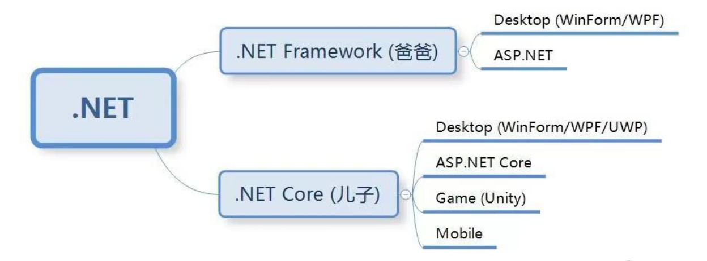

# .Net-Core-Framework的历史及web和MVC的关系

## .Net/.Net Core/.Net Framework 的历史


.NET Framework、.NET Core 和 .NET 是 Microsoft 开发的不同版本的软件开发平台。它们有一些共同的特性，但也有一些重要的区别。

1. **.NET Framework**:
    - .NET Framework 是最早推出的版本，最初发布于 2002 年。它是一个用于构建和运行 Windows 应用程序的框架。
    - .NET Framework 依赖于 Windows 操作系统，并且只能在 Windows 上运行。
    - 它提供了广泛的类库和功能，包括 Windows Forms、[ASP.NET](http://asp.net/)、[ADO.NET](http://ado.net/) 等，以支持各种类型的应用程序开发。
    - 最终版本是 .NET Framework 4.8，发布于2019年4月，是 .NET Framework 的最后一个主要版本。Microsoft 宣布不会发布更高版本的 .NET Framework，未来主要集中在 .NET Core 和 .NET 5+ 上的开发。
2. **.NET Core**:
    - .NET Core 是微软于2016年推出的全新开源的跨平台框架。
    - [与.NET](http://xn--jhq.net/) Framework不同，.NET Core 可以在 Windows、macOS 和 Linux 等多个平台上运行。
    - .NET Core 更加轻量化、模块化，并且具有更快的性能。它专注于云原生应用程序和微服务架构。
    - .NET Core 的最终版本是 .NET Core 3.1，发布于2019年12月。这是 .NET Core 项目的最后一个稳定长期支持版本（LTS）。随后，.NET Core 项目合并到 .NET 5+ 中，形成统一的 .NET 平台。
3. **.NET**:
    - .NET 是一个更广泛的术语，用来指代整个 .NET 平台生态系统，包括 .NET Framework、.NET Core 和其他相关工具、技术和语言。
    - 在未来的版本中，微软可能会进一步整合 .NET Framework 和 .NET Core，使得它们更加统一，以提供更好的开发体验和跨平台支持。
4. **.NET 5**:
    - .NET 5 是 .NET Core 3.1 之后的第一个发布版本，于2020年11月发布。随后的版本为 .NET 6、.NET 7 等。从 .NET 5 开始，Microsoft 将 .NET Core、.NET Framework 和 Xamarin 合并为一个单一平台，统称为 .NET。

总的来说，.NET Framework 主要用于传统的 Windows 应用程序开发，而 .NET Core 则更适合于跨平台和云原生应用程序开发。随着时间的推移，微软正逐渐将开发重心转移到 .NET Core

### 关系与演化路径

- **ASP 到 ASP.NET**: ASP.NET是对ASP的彻底重写，提供了更强大的功能和现代化编程支持，完全基于.NET Framework。
- **ASP.NET 到 ASP.NET Core**: ASP.NET Core是对ASP.NET的重写，基于.NET Core，具备跨平台、高性能、现代化开发特性。ASP.NET Core与ASP.NET虽然在名字上相似，但它们的底层实现和架构有很大区别。
- **.NET Framework 到 .NET Core**: .NET Core是.NET Framework的跨平台版本，解决了后者只能在Windows上运行的局限性，并进一步提升了性能和灵活性。

### .NET Framework 版本历史

.NET Framework 是微软推出的一个全面的开发平台，用于构建和运行各种类型的应用程序，包括桌面应用、Web应用、移动应用等。以下是 .NET Framework 的版本历史及命名方式.

1. **.NET Framework 1.0**
    - **发布日期**: 2002年2月13日
    - **主要特性**: 初次发布，包含CLR（公共语言运行时）、基础类库、ASP.NET和ADO.NET。
2. **.NET Framework 1.1**
    - **发布日期**: 2003年4月24日
    - **主要特性**: 增加了移动设备支持和OOP（面向对象编程）的改进。
3. **.NET Framework 2.0**
    - **发布日期**: 2005年11月7日
    - **主要特性**: 引入了泛型、匿名方法、部分类和数据绑定等功能。
4. **.NET Framework 3.0**
    - **发布日期**: 2006年11月6日
    - **主要特性**: 引入了WPF（Windows Presentation Foundation）、WCF（Windows Communication Foundation）、WF（Windows Workflow Foundation）和CardSpace。
5. **.NET Framework 3.5**
    - **发布日期**: 2007年11月19日
    - **主要特性**: 增加了LINQ（语言集成查询）、表达式树和扩展方法。
6. **.NET Framework 4.0**
    - **发布日期**: 2010年4月12日
    - **主要特性**: 引入了并行编程和动态语言运行时。
7. **.NET Framework 4.5**
    - **发布日期**: 2012年8月15日
    - **主要特性**: 改进了异步编程模型，引入了ASP.NET Web API和增强的WPF、WCF功能。
8. **.NET Framework 4.5.1**
    - **发布日期**: 2013年10月17日
    - **主要特性**: 进一步增强了性能和调试工具。
9. **.NET Framework 4.5.2**
    - **发布日期**: 2014年5月5日
    - **主要特性**: 小幅改进，增强了稳定性和性能。
10. **.NET Framework 4.6**
    - **发布日期**: 2015年7月20日
    - **主要特性**: 引入了RyuJIT编译器和新的加密API。
11. **.NET Framework 4.6.1**
    - **发布日期**: 2015年11月30日
    - **主要特性**: 增强了WPF、WCF和ASP.NET的功能。
12. **.NET Framework 4.6.2**
    - **发布日期**: 2016年8月2日
    - **主要特性**: 改进了.NET Core兼容性和高DPI支持。
13. **.NET Framework 4.7**
    - **发布日期**: 2017年4月5日
    - **主要特性**: 增加了对Windows 10新特性的支持，改进了性能。
14. **.NET Framework 4.7.1**
    - **发布日期**: 2017年10月17日
    - **主要特性**: 改进了对.NET Standard 2.0的支持。
15. **.NET Framework 4.7.2**
    - **发布日期**: 2018年4月30日
    - **主要特性**: 增强了诊断工具和性能改进。
16. **.NET Framework 4.8**
    - **发布日期**: 2019年4月18日
    - **主要特性**: 增强了高DPI支持、访问控制和性能。

#### 命名规则

- **版本号**: .NET Framework 的版本号通常由三部分组成，例如：`4.7.2`，其中`4`代表主版本号，`7`代表次版本号，`2`代表修订号。
- **累积更新**: 在某些主版本和次版本之间，微软会发布累积更新（如4.5.1，4.5.2）以包含新特性和修复。

#### 总结

- **早期版本（1.x - 3.5）**: 主要是功能的初步实现和基础设施的搭建，如CLR、ASP.NET、WPF、WCF等。
- **4.x 系列**: 主要是性能提升和与现代开发需求的对齐，如异步编程、并行编程、跨平台兼容性等。
- **命名方式**: 使用清晰的版本号表示版本的演进和特性的增加，从而帮助开发者了解每个版本的新增功能和改进。

.NET Framework 提供了一个全面而稳健的平台，用于构建各种类型的应用程序。随着 .NET Core 的发展和统一，.NET 平台继续向跨平台和高性能方向发展。

### .NET Core 版本历史

.NET Core 是微软为实现跨平台支持和现代化开发需求推出的跨平台、高性能框架。`在2020年11月发布的 .NET 5 之后，.NET Core 与 .NET Framework 统一为 .NET`。以下是 .NET Core 和 .NET 的版本历史及命名方式.

1. **.NET Core 1.0**
    - **发布日期**: 2016年6月27日
    - **主要特性**: 首次推出，支持Windows、Linux和macOS，包含基础库和运行时。
2. **.NET Core 1.1**
    - **发布日期**: 2016年11月16日
    - **主要特性**: 增加了对更多APIs的支持，改进性能和工具。
3. **.NET Core 2.0**
    - **发布日期**: 2017年8月14日
    - **主要特性**: 大幅扩展API集合，引入.NET Standard 2.0，提升库的兼容性和移植性。
4. **.NET Core 2.1**
    - **发布日期**: 2018年5月30日
    - **主要特性**: 长期支持版本（LTS），改进性能，增加新工具（如gRPC支持）和APIs。
5. **.NET Core 2.2**
    - **发布日期**: 2018年12月4日
    - **主要特性**: 增强性能和诊断功能，引入健康检查API。
6. **.NET Core 3.0**
    - **发布日期**: 2019年9月23日
    - **主要特性**: 支持Windows桌面应用（WinForms和WPF），改进了.NET Core中的gRPC、C# 8.0特性和EF Core 3.0。
7. **.NET Core 3.1**
    - **发布日期**: 2019年12月3日
    - **主要特性**: 长期支持版本（LTS），修复了3.0中的一些问题并改进了性能和稳定性。

#### .NET 版本历史（统一后的版本）

1. **.NET 5**
    - **发布日期**: 2020年11月10日
    - **主要特性**: 统一了.NET Core和.NET Framework，引入了单一的SDK、库和运行时，提高性能，支持更多的应用类型。
2. **.NET 6**
    - **发布日期**: 2021年11月8日
    - **主要特性**: 长期支持版本（LTS），增强跨平台支持和性能，引入了更多的语言特性和开发工具，改进了MAUI（跨平台UI框架）。
3. **.NET 7**
    - **发布日期**: 2022年11月8日
    - **主要特性**: 继续改进性能和工具链，增强云原生应用支持，引入了更多的APIs和改进的开发体验。
4. **.NET 8**
    - **预计发布日期**: 2023年11月
    - **主要特性**: 进一步提升性能，改进开发者体验，增强对现代化应用架构（如微服务和容器）的支持。

#### 命名规则

- **.NET Core 1.x - 3.x**: 使用版本号，如1.0, 1.1, 2.0, 2.1, 2.2, 3.0, 3.1。
- **.NET 5 及之后**: 直接使用数字版本号，不再使用“Core”后缀，如.NET 5, .NET 6, .NET 7, .NET 8。

#### 总结

- **.NET Core 1.0 - 3.1**: 是.NET跨平台化和现代化的起点，命名为.NET Core。
- **.NET 5 及之后**: 统一命名为.NET，简化了版本号，并融合了.NET Framework和.NET Core的功能，提供单一的开发平台。

这种命名和版本演进反映了微软从早期的独立平台逐步走向跨平台统一的战略。

### .NET Framework 和 NET Core生态成员

#### .NET Framework 平台包含的组件和特性

.NET Framework 是一个用于 Windows 的开发平台，它包含以下主要组件和特性：

1. **CLR (Common Language Runtime)**
    - 管理代码执行，提供垃圾收集、异常处理、类型安全、线程管理和安全性。
2. **BCL (Base Class Library)**
    - 基础类库，提供了常用功能，如集合、I/O、字符串处理、网络、XML处理和数据访问。
3. **ASP.NET**
    - 用于构建动态网页和 Web 应用程序的框架。
4. **ADO.NET**
    - 数据访问技术，用于与数据库进行交互。
5. **WPF (Windows Presentation Foundation)**
    - 用于构建桌面应用程序的图形子系统，支持丰富的用户界面、图形和媒体内容。
6. **WinForms (Windows Forms)**
    - 用于构建桌面应用程序的图形界面库。
7. **WCF (Windows Communication Foundation)**
    - 用于构建分布式和服务导向应用程序的框架。
8. **WF (Windows Workflow Foundation)**
    - 用于构建工作流和业务流程的框架。
9. **Entity Framework**
    - 对象关系映射（ORM）框架，用于数据访问。
10. **Visual Studio IDE**
    - 开发工具，用于创建、调试和部署 .NET 应用程序。

#### .NET Core 平台包含的组件和特性

.NET Core 是一个跨平台、开源的开发平台，支持 Windows、macOS 和 Linux。它包含以下主要组件和特性：

1. **CoreCLR**
    - .NET Core 的运行时，提供垃圾收集、JIT 编译和类型系统。
2. **CoreFX**
    - 基础类库，类似于 .NET Framework 的 BCL，提供常用功能，如集合、I/O、字符串处理、网络、XML处理和数据访问。
3. **ASP.NET Core**
    - 用于构建现代 Web 应用程序和服务的跨平台框架。
4. **Entity Framework Core**
    - 跨平台的 ORM 框架，用于数据访问。
5. **CLI (Command Line Interface)**
    - 用于创建、构建、运行和发布 .NET Core 应用程序的命令行工具。
6. **跨平台支持**
    - 支持在 Windows、macOS 和 Linux 上运行和开发。
7. **NuGet 包管理**
    - 用于管理和分发 .NET Core 库和依赖项。
8. **轻量级和模块化**
    - 允许开发者只包含应用程序所需的库和组件，减少应用程序的体积。
9. **高性能和云优化**
    - 针对云原生应用和微服务架构进行了优化。
10. **Visual Studio Code 和 Visual Studio IDE**
    - 跨平台的开发工具，支持 .NET Core 的开发、调试和部署。

#### 对比和总结

- **平台依赖**:
    - .NET Framework 主要用于 Windows 平台。
    - .NET Core 是跨平台的，支持 Windows、macOS 和 Linux。
- **应用类型**:
    - .NET Framework 适合现有的 Windows 桌面应用和企业级应用。
    - .NET Core 适合现代化的云原生应用、微服务和跨平台应用。
- **性能和扩展性**:
    - .NET Core 具有更好的性能和扩展性，适合高性能和大规模分布式系统。
- **开源和社区**:
    - .NET Core 是完全开源的，拥有活跃的社区支持和贡献。
- **未来方向**:
    - .NET Core 是未来的发展方向，.NET 5 开始统一 .NET Framework 和 .NET Core，形成一个统一的 .NET 平台。

通过对比可以看出，.NET Core 在现代应用开发中的优势更加明显，尤其是在跨平台和高性能应用方面，而 .NET Framework 仍然在需要紧密集成 Windows 的传统应用中占有一席之地。

### 安装

#### 安装 .NET Framework 组件

.NET Framework 通常作为一个整体安装包进行安装，包含了所有必要的组件。以下是安装步骤：

1. **从官方网站下载 .NET Framework 安装程序**：
    - 访问微软官方网站（[.NET Download](https://dotnet.microsoft.com/download/dotnet-framework)）下载适合的 .NET Framework 版本。
2. **运行安装程序**：
    - 下载后，运行安装程序并按照屏幕提示进行安装。安装程序将自动安装所有必需的组件，如 CLR、BCL、ASP.NET 等。
3. **使用 Visual Studio 安装**：
    - 如果使用 Visual Studio 开发环境，可以通过 Visual Studio 安装程序选择并安装适合的 .NET Framework 版本。Visual Studio 会自动配置和安装所需的组件。

#### 安装 .NET Core / .NET 5+ 组件

.NET Core 和 .NET 5+ 是统一安装的 SDK（Software Development Kit），包含了所有必要的工具和组件。以下是安装步骤：

1. **从官方网站下载 .NET SDK**：

    - 访问微软官方网站（[.NET Download](https://dotnet.microsoft.com/download)）下载适合的 .NET SDK 版本。

2. **运行安装程序**：

    - 下载后，运行安装程序并按照屏幕提示进行安装。安装程序将自动安装所有必需的组件，如 CoreCLR、CoreFX、ASP.NET Core 等。

3. **使用命令行工具安装**：

    - 安装后，可以通过命令行工具 `dotnet` 进行开发和管理。例如，创建新项目、添加依赖项、编译和运行应用程序等。

    - 示例命令：

      ```
      bashCopy codedotnet new console -o MyApp    # 创建新的控制台应用程序
      dotnet build MyApp             # 编译应用程序
      dotnet run MyApp               # 运行应用程序
      ```

4. **使用 Visual Studio Code 或 Visual Studio 安装**：

    - 安装 .NET SDK 后，可以使用 Visual Studio Code 或 Visual Studio 进行开发。两者都提供了良好的支持和集成。
    - 在 Visual Studio 中，选择适合的 .NET Core 或 .NET 5+ 项目模板进行创建。

#### 安装特定组件  

- NuGet 包管理器：  

    - .NET Core 和 .NET 5+ 使用 NuGet 包管理器来管理额外的库和依赖项。可以通过命令行或 IDE 内置的 NuGet 管理工具来安装。

    - 示例命令：

      ```
      bash
      Copy code
      dotnet add package Newtonsoft.Json    # 安装 Newtonsoft.Json 库
      ```

#### 统一安装 vs 分别安装  

- **.NET Framework**：
    - 作为整体安装包进行安装，一次性包含所有组件。
- **.NET Core / .NET 5+**：
    - 通过统一的 SDK 安装，包含所有核心组件和工具。额外的库和依赖项可以通过 NuGet 单独安装。

#### 总结  

- **.NET Framework** 是一个整体安装包，包含所有核心组件，适合 Windows 平台。
- **.NET Core / .NET 5+** 通过统一的 SDK 安装，包含核心组件和工具，支持跨平台开发。额外的库和依赖项可以通过 NuGet 管理。

这使得安装和管理 .NET Core / .NET 5+ 更加灵活和模块化，适应现代开发需求。


## ASP.NET Web 和 MVC 的关系  
Web 是一个宽泛的术语,而 asp.net web就是为了实现web的一直开发框架集其中包含了Web Forms、 Web Pages等,MVC和前后端分离等都是在使用开发框架时的一种开发模式.

### Web 

在Java生态中实现Web这个概率的技术为spring和jsp等，在C#生态中实现Web这个概率的技术为 [ASP.NET](http://asp.net/) Web 。  
具体来说，[ASP.NET](http://asp.net/) Web 可以指代几种不同的技术和框架，主要包括：

#### [ASP.NET](http://asp.net/) Web Forms：
    - 基于事件驱动的 Web 应用程序开发模型。
    - 使用 **.aspx后缀名** 文件作为视图，并包含后台代码文件通常是 **.aspx.cs 或 .aspx.vb 后缀名**。
    - 提供丰富的服务器控件和事件模型，适合快速开发和复杂的用户交互。
    - **为什么是Forms(窗体界面)**: 早期微软的.net framework 只支持Windows平台,所以web前端就是窗体界面。
#### [ASP.NET](http://asp.net/) Web Pages：
    - 使用 Razor 语法(**.cshtml后缀名的文件**)的一种轻量级 Web 开发模型，类似于 PHP 或 Classic ASP。
    - 允许直接在 **.cshtml文件后缀名** 文件中的HTML代码中嵌入 C# 代码，并生成动态内容。
### MVC
**他本身不是什么技术**而是基于模型-视图-控制器（MVC）的**架构模式**,在ASP.NET Web Forms和ASP.NET Web Pages同样可以使用MVC模式来开发,同理JavaWeb中的jsp和spring等也可以使用这种方式来开发。
#### [ASP.NET](http://asp.net/) MVC：
    
    - 分离关注点，通过控制器处理用户请求并选择适当的视图来呈现数据。
    - 使用 Razor 视图引擎(**.cshtml后缀名**)创建动态视图，推崇良好的代码组织和可测试性。
#### [ASP.NET](http://asp.net/) Core MVC：
    - [ASP.NET](http://asp.net/) Core 框架中的 MVC 实现，具有跨平台、高性能和现代化的特点。
    - 提供了与传统 [ASP.NET](http://asp.net/) MVC 相似的开发模式和特性，但具有更轻量级、更灵活和更高性能的优势。

[ASP.NET](http://asp.net/) Web 技术是 Microsoft 提供的一系列工具和框架，用于构建现代化、高性能的 Web 应用程序。开发者可以根据项目需求和技术偏好选择合适的 [ASP.NET](http://asp.net/) Web 技术栈来开发应用程序。


## ASP.NET Web 技术的各种文件后缀名
### .asp 后缀的文件  
    - .asp 文件是经典 ASP（Active Server Pages）的文件扩展名。ASP 是一种由微软开发的服务器端脚本技术，用于动态生成和交互式地展示网页。ASP 使用 VBScript 或 JavaScript 作为服务器端脚本语言。通常，ASP 文件包含 HTML 和服务器端代码的混合，这些代码可以生成动态内容并与数据库或其他服务器资源交互。
    - .asp 基于经典 ASP 技术，使用 VBScript 或 JavaScript。
    - .asp 在早期 Web 开发中使用较多，现在多数已被 ASP.NET 取代。

### .aspx 后缀的文件  
    - .aspx 文件是 ASP.NET 的文件扩展名。ASP.NET 是微软推出的用于构建动态 Web 应用程序的技术框架。与经典 ASP 不同，ASP.NET 使用 C#、VB.NET 等编程语言作为服务器端脚本语言。.aspx 文件包含 HTML、ASP.NET 控件以及服务器端代码，这些代码通过事件驱动模型响应用户交互和其他请求。
    - .aspx 基于 ASP.NET 框架，使用 C#、VB.NET 等作为服务器端脚本语言。
    - .aspx 是 ASP.NET 应用程序中最常见的文件类型，用于构建复杂的 Web 应用程序。
### .cshtml 后缀的文件  
    - .cshtml 文件是 Razor 视图引擎使用的文件扩展名。Razor 是 ASP.NET MVC 框架中的一种视图引擎，允许将 C# 代码和 HTML 代码混合在同一个文件中。.cshtml 文件通常包含 HTML 结构和 Razor 语法，Razor 语法允许在 HTML 中嵌入 C# 代码，以便动态生成内容并显示在客户端。
    - .cshtml 是 Razor 视图引擎的文件扩展名，结合了 C# 代码和 HTML 结构。
    - .cshtml 是 ASP.NET MVC 或 Razor Pages 中用来渲染视图的文件类型，支持通过 Razor 语法混合 C# 和 HTML。

所有这些文件类型都支持动态生成内容，但使用不同的服务器端脚本语言和技术。

总体而言，这些文件扩展名代表了不同时期和技术栈下的服务器端 Web 开发方式，各自有着特定的用途和优势。

### Razor  
Razor 文件后缀名是 **.cshtml**, 是由 Microsoft 开发的一种用于创建动态 Web 页面的视图引擎。它最初是为 ASP.NET MVC 框架设计的，但后来也被整合到 ASP.NET Core 中使用。
#### 主要特点和用途：
- 语法简洁性：
Razor 提供了一种简洁、直观的语法，允许开发者在 HTML 中嵌入 C# 代码，使得页面的动态内容生成和控制变得更加自然和简单。

- 代码混编：
Razor 允许在 HTML 页面中直接嵌入 C# 代码，使用 @ 符号标识，这使得数据绑定、条件逻辑和循环等操作可以直接在页面上进行。

- 强类型视图：
Razor 支持强类型视图，即通过将视图与特定的数据模型绑定，可以在视图中直接访问模型的属性和方法，提高了代码的可维护性和安全性。

- 部分视图和布局：
Razor 支持部分视图（Partial Views）和布局视图（Layout Views），使得页面结构的重用和管理变得更加方便和灵活。

- 集成性：
Razor 能够与不同版本的 ASP.NET 框架集成使用，包括 ASP.NET MVC、ASP.NET Core MVC 等，为开发者提供统一的视图渲染体验。

#### Razor 的工作原理：
Razor 通过识别 @ 符号后的 C# 代码段，并将其转换为合适的代码来处理。在 Razor 视图中，可以通过 @ 符号插入 C# 表达式、代码块或者调用服务和组件。以下是 Razor 的一些基本语法示例：

- 插入表达式：
```.cshtml
<p>Welcome, @User.Name!</p>
```

代码块：
```.cshtml
@if (User.IsLoggedIn){
    <p>Welcome back!</p>
}
```
- 循环：
```.cshtml
<ul>
    @foreach (var item in Model.Items)
    {
        <li>@item.Name</li>
    }
</ul>
```
- 部分视图：
```.cshtml
@Html.Partial("_PartialViewName")
```

通过这些语法，Razor 提供了一种优雅而强大的方式来创建动态的、高效的 Web 页面，同时保持了视图和逻辑的清晰分离。

## Web和传统开发模式与MVC开发模式关系总结  
Web和MVC都是概念,只不过MVC这个概念通常被用来服务Web这个概念,也就是说MVC这个理念是为了更好的理解和实现Web这个理念而存在的另一种新新思想,  
并且他们都有着实现这对应的技术框架,  
早期实现Web这个技术概念的是ASP.NET Web Pages、ASP.NET Web Forms等等  
而后期又发明了一种新的概念,而这个新的概念是在Web基础上升级而来的,他就是MVC,MVC同样也是一种概念

三者关系类似于一个顶级接口一个二级接口:

```text
Web 思想的接口
 |
 |
 | -----> 传统开发模式: 采用 ASP.NET Web Pages、ASP.NET Web Forms等技术框架 (实现了Web思想接口)
 |
 ----MVC 思想的接口 (继承了Web思想的接口的内容并且加入了自己额外的东西和修改)
      |
      |
      -----> MVC开发模式: 采用 ASP.NET MVC 技术框架 (实现了MVC接口-同时也间接实现了Web接口)
```


