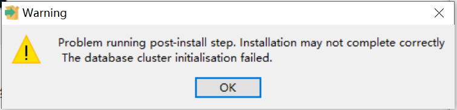

# PostgreSQL
一个强大的开源对象关系数据库系统，支持复杂查询和高级特性。


### 通用配置

```shell
# 开放 5432 端口 处理防火墙

# 打开postgresql的数据存储目录:
/var/lib/pgsql/16/data/ # Linux-Rocky dnf安装默认地址
D:\DevelopmentKit\PostgreSQL\data # Windows

# 找到pg_hba.conf文件，默认情况下，只有127.0.0.1能连接数据库，若需要开放给其他IP连接，可以加一行记录:
host    all             all             0.0.0.0/0               md5

# 修改postgresql.conf文件，搜索找到 listen_addresses 配置项 ，
# 把监听地址#listen_addresses = 'localhost' 取消注释并把localhost改成 * 即:
listen_addresses = 'localhost'
# 把max_connections最大连接数改成1000或者更大 即:
max_connections = 1000
# 把wal的保留个数该为3 即:
wal_keep_segments=3
# 原文链接: https://developer.kingdee.com/article/398864661983842560?productLineId=29

```

### 通用基本命令

```shell
# Windows
psql.exe -U postgres -d shop # 查看是否启动成功
pg_ctl -D "D:\DevelopmentKit\PostgreSQL\data" start # 启动
pg_ctl -D "D:\DevelopmentKit\PostgreSQL\data" stop # 关闭
pg_ctl -D "D:\DevelopmentKit\PostgreSQL\data" restart # 重启
pg_ctl -D "D:\DevelopmentKit\PostgreSQL\data" status # 状态

# Linux-Rocky
systemctl start postgresql-16.service # 启动
systemctl stop postgresql-16.service # 关闭
systemctl restart postgresql-16.service # 重启
systemctl status postgresql-14.service # 状态

# 通用
\q # 退出PostgreSQL命令行界面
\l # 查看数据库
SELECT datname, pg_size_pretty(pg_database_size(datname)) AS size FROM pg_database; # 查看数据库详细信息

```

### 语法案例

```sql
create table stations(
	id serial primary KEY,
	value text,
	label text
);
```


### 错误码

```shell
28000 # 通常是指用户名或密码无效导致的登录失败。确保授予该用户登录权限并输入了正确的用户名和密码，以及检查您是否已经允许从远程主机连接到 PostgreSQL 数据库。另外，可以检查防火墙设置是否阻止了来自该远程主机的连接以及配置了 \PostgreSQL\data\pg_hba.conf 的 local   all  和 host    all
```


### 常见问题

```shell
默认没有初始账号和密码!!!
sudo -u postgres psql # 使用系统用户"postgres"登录到数据库服务器的命令行界面
ALTER USER postgres WITH PASSWORD 'postgres'; # 为postgres账户设置密码：

psql: 错误: 连接到"localhost" (::1)上的服务器，端口5432失败：致命错误:  角色 "postgres" 不存在 # 删除data从新初始化参照 Windows10安装→数据库群集初始化失败


```


### RockyLinux8和9安装

#### DNF源简便安装

```shell
# 该方案有摘自官网: https://www.postgresql.org/download/linux/redhat/

# 打开防火墙上的这两个端口
sudo firewall-cmd --zone=public --add-port=5432/tcp --permanent
sudo firewall-cmd --zone=public --add-port=5433/tcp --permanent
sudo firewall-cmd --reload # 重启生效
sudo firewall-cmd --list-ports # 查看防火墙开放的端口
sudo firewall-cmd --list-services # 查看某个特定服务已经打开的端口
# 或 华为云/阿里云等 控制台面板 开放相关端口

# Install the repository RPM: 
# 安装 PostgreSQL 存储库 RPM, 将从 PostgreSQL 官方网站下载最新的存储库 RPM，并使用 dnf 包管理器安装它。存储库 RPM 将为您提供安装 PostgreSQL 所需的依赖项、软件包和元数据。
sudo dnf install -y https://download.postgresql.org/pub/repos/yum/reporpms/EL-9-x86_64/pgdg-redhat-repo-latest.noarch.rpm # rockylinux 9
sudo dnf install -y https://download.postgresql.org/pub/repos/yum/reporpms/EL-8-x86_64/pgdg-redhat-repo-latest.noarch.rpm # rockylinux 8

# Disable the built-in PostgreSQL module: 
# 禁用 Fedora 或 RHEL 系统中默认安装的 PostgreSQL 模块。如果您想要安装其他版本的 PostgreSQL，您需要首先禁用内置的模块
sudo dnf -qy module disable postgresql

# 自定义安装路径
# 这种方式安装 PostgreSQL 后，启动和管理 PostgreSQL 服务的方式可能会有所不同。您需要手动配置数据库初始化和启动脚本，并确保在 PostgreSQL 中使用正确的目录路径 # 安装之前先禁用内置的 PostgreSQL 模块
sudo dnf install -y --installroot=/opt/postgresql16/ postgresql16-server

# Install PostgreSQL:
# 使用 dnf 包管理器安装 PostgreSQL 16 服务器软件包及其相关工具
sudo dnf install -y postgresql16-server

# Optionally initialize the database and enable automatic start:
# 初始化 PostgreSQL 数据库,创建必要的目录结构和配置文件,并生成一个空的初始数据库
sudo /usr/pgsql-16/bin/postgresql-16-setup initdb

sudo systemctl enable postgresql-16 # 启用 PostgreSQL 16 服务的自动启动.
sudo systemctl start postgresql-16 # 启动 PostgreSQL 16 服务。执行此命令后，PostgreSQL 将开始运行

sudo -u postgres psql  # 进入pgsql
ALTER USER postgres WITH PASSWORD 'new_password'; # 为 postgres 用户设置密码

psql -h localhost -U postgres # 命令连接到本地 PostgreSQL 数据库(需要输入密码)

\du # 检查postgres用户具有的权限
\q # 退出 PostgreSQL Shell 并继续使用 PostgreSQL

sudo systemctl enable postgresql-16 # 启用 postgresql-16 服务，并将其添加到开机自启动项中
sudo systemctl restart postgresql-16 # 手动重启
sudo systemctl stop postgresql-16 # 手动停止
sudo systemctl start postgresql-16 # 手动启动
sudo systemctl status postgresql-16 # 查看运行状态
```

### Docker for Linux安装
```shell
# 拉取一个PostgreSql 17 镜像
docker pull bitnami/postgresql:17.2.0
```

创建挂载目录
``` shell
mkdir -p /docker/mysql/datas
```
确保该目录的权限允许 Docker 容器访问。可以尝试更改目录的权限，确保它对 Docker 容器可写：
```shell
sudo chown -R 1001:1001 /docker/postgresql/datas
sudo chmod -R 755 /docker/postgresql/datas
```

如果不是 root 用户运行 Docker，需要重新启动 Docker 服务并确保它以 root 权限启动：
```shell
sudo systemctl restart docker
```


启动镜像
```shell
docker run -d -p 5432:5432 --restart always --name PostgreSQL17 \
-e POSTGRES_PASSWORD=DevCaikun666 \
-e PGDATA=/bitnami/postgresql/data \
-v /docker/postgresql/datas:/bitnami/postgresql/data \
bitnami/postgresql:17.2.0

    # 参数说明
    #  --name postgres17: 设置容器名称为 postgres17。
    #  -e POSTGRES_PASSWORD=DevCaikun666: 设置数据库超级用户 postgres 的密码为 DevCaikun666。可以根据需要修改此密码。
    #  -d: 以后台模式运行容器。
    #  -p 5432:5432: 将本地主机的 5432 端口映射到容器的 5432 端口，这是 PostgreSQL 默认的端口。
    #  -v /docker/postgresql/datas:/var/lib/postgresql/datas: 使用 /docker/postgresql/datas 的 Docker 卷来存储数据库数据，以便容器重启时保留数据。
```


### Windows10本地安装


#### 数据库群集初始化失败



##### 方法一(手动初始化)

```shell
关闭防火墙，把火绒等电脑管理软件设为免打扰
打开相关文件夹权限——完全控制

管理员运行cmd并cd到bin目录下
# 手动初始化并创建 PostgreSQL 超级用户
initdb -U postgres -E utf8 -W -A trust -D D:\DevelopmentKit\PostgreSQL\data
# -U postgres 指定使用 "postgres" 用户进行初始化。
# -E utf8 指定数据库编码为 UTF-8。
# -W 提示您输入密码。按照提示输入密码并确认。
# -A trust 授权所有用户在不提供密码的情况下连接到数据库。这只是用于初始化阶段，安全性考虑下请在生产环境中配置适当的认证方式。

pg_ctl.exe register -N PostgreSQL16 -D D:\DevelopmentKit\PostgreSQL\data # 开启数据库服务

# 完成初始化后，启动 PostgreSQL 服务器
在服务里启动 PostgreSQL16
pg_ctl -D "D:\DevelopmentKit\PostgreSQL\data" start # 运行命令启动

出现拒绝访问: 给Postgresql的安装目录及数据库目录的权限里添加NETWORK_SERVER账户和完全访问控制权 并在→服务→属性→登录→此账户 修改为  NETWORK SERVICE
把安装目录添加
```

##### 方法二(卸载重置)

https://forums.holdemmanager.com/general-support/150771-solved-postgresql-database-cluster-initialisation-failed.html

https://dba.stackexchange.com/questions/10241/postgresql-the-database-cluster-initialization-failed

1. 卸载 PostgreSQL

2. 如果 postgres 用户仍然存在，请将其删除。

   ```sql
   net user postgres /delete
   ```

3. 使用您可以记住的密码创建 postgres 用户

   ```sql
   net user /add postgres <password>
   ```

4. 将 postgres 用户添加到管理员组

   ```sql
   net localgroup administrators postgres /add
   ```

5. 将 postgres 用户添加到 Power Users 组

   ```sql
   net localgroup "power users" postgres /add
   ```

6. 以 postgres 用户身份运行命令窗口

   ```sql
   runas /user:postgres cmd.exe
   ```

7. 从命令窗口中运行安装文件。

   ```sql
   C:\Download\postgresql-9.1.4-1-windows.exe
   ```

   这应该会成功运行安装。

8. 从管理员组中删除 postgres 用户。

   ```sql
   net localgroup administrators postgres /delete
   ```

### Docker for Windows安装

#### 前置要求

1. **安装Docker Desktop**: 确保Docker Desktop已经安装并运行在你的Windows系统上。如果还没有安装，可以从Docker的官方网站下载并安装 Docker Desktop for Windows。
2. **创建Docker Hub账户**: 如果还没有Docker Hub账户，请创建一个，并确保你可以登录。

#### PostgreSQL 17.1.0安装步骤

1. **打开命令行工具**: 可以使用PowerShell、cmd或者Windows Terminal。

2. **拉取PostgreSQL镜像**: 执行以下命令来从Docker Hub拉取最新的PostgreSQL镜像：
```shell
docker pull bitnami/postgresql:17.1.0
```
3. **运行PostgreSQL容器**: 执行以下命令来运行PostgreSQL容器。你可以设置自定义的环境变量（例如POSTGRES_PASSWORD等）：  

```shell
docker run -d -p 5432:5432 --restart always --name PostgreSQL17 -e POSTGRES_PASSWORD=DevCaikun666 -e PGDATA=/var/lib/postgresql/data -v E:\DevelopmentKitProject\Docker\PostgreSQL\Data:/var/lib/postgresql/data bitnami/postgresql:17.1.0
```
   其中：

   - 参数 --restart always 在容器退出时总是重启容器,如果不需要重启则设置为 --restart no。  
   - 参数 -e POSTGRES_PASSWORD=DevCaikun666 环境变量，指定了 PostgreSQL 默认 postgres 用户的密码。  
   - 参数 -e PGDATA=/var/lib/postgresql/data/pgdata 环境变量，指定了 PostgreSQL 的数据存储目录。  
   - 参数 -v E:\DevelopmentKitProject\Docker\PostgreSQL\Data:/var/lib/postgresql/data 将  
     容器内的 /var/lib/postgresql/data 数据目录映射到物理机的 E:\DevelopmentKitProject\Docker\PostgreSQL\Data 目录下。  

4. **验证PostgreSQL是否在运行**: 你可以运行以下命令来查看PostgreSQL容器的运行状态：

```shell
docker ps
```


#### PostgreSQL 16.3安装步骤

1. **打开命令行工具**: 可以使用PowerShell、cmd或者Windows Terminal。

2. **拉取PostgreSQL镜像**: 执行以下命令来从Docker Hub拉取最新的PostgreSQL镜像：

   ```shell
   docker pull postgres:16.3
   ```

3. **运行PostgreSQL容器**: 执行以下命令来运行PostgreSQL容器。你可以设置自定义的环境变量（例如POSTGRES_PASSWORD等）：

   ```shell
   docker run --name PostgreSQL16.3 -e POSTGRES_PASSWORD=DevCaikun666 -p 5432:5432 -d postgres:16.3
   ```

   其中：

    - `--name PostgreSQL16.3` 设置容器的名称。
    - `-e POSTGRES_PASSWORD=DevCaikun666` 设置PostgreSQL数据库`postgres`用户的密码。
    - `-p 5432:5432` 将容器的5432端口映射到主机的5432端口，这样可以通过主机的端口访问PostgreSQL。
    - `-d` 表示容器将以分离模式（detached mode）运行。

4. **验证PostgreSQL是否在运行**: 你可以运行以下命令来查看PostgreSQL容器的运行状态：

   ```shell
   docker ps
   ```

   如果一切正常，你应该能够看到名为`PostgreSQL16.3`的容器在运行。

5. **连接到PostgreSQL**: 你可以使用pgAdmin、DBeaver或其他PostgreSQL客户端工具连接到你的PostgreSQL实例。连接信息如下：

    - **主机名**: `localhost` 或者 `127.0.0.1`
    - **端口**: `5432`
    - **用户名**: `postgres`
    - **密码**: 你在第3步中设置的密码 (`DevCaikun666`)

#### 其他管理命令

- **停止PostgreSQL容器**:

  ```shell
  docker stop PostgreSQL16.3
  ```

- **启动PostgreSQL容器**:

  ```shell
  docker start PostgreSQL16.3
  ```

- **删除PostgreSQL容器**: 停止容器后再执行删除命令。

  ```shell
  docker rm PostgreSQL16.3
  ```

- **查看容器日志**:

  ```shell
  docker logs PostgreSQL16.3
  ```


