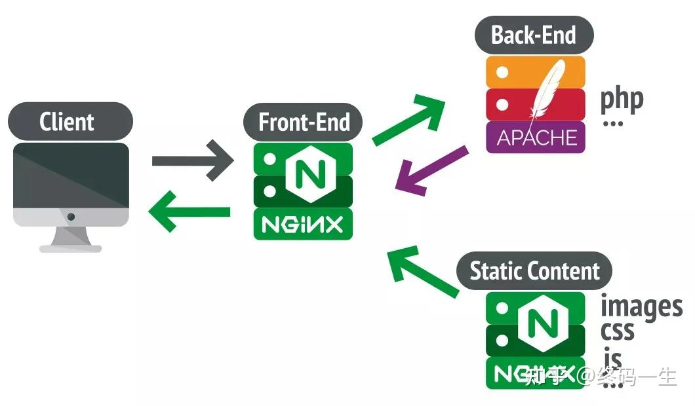

# Nginx

Nginx架构图


## 一.下载 Nginx 镜像

```shell
docker pull nginx:1.27
```

## 二.运行 Nginx 容器

```shell
docker run -d -p 80:80 --name nginx nginx:1.27.3
    #-p 80:80: 将宿主机的 80 端口映射到容器的 80 端口上,
    #-d: 以后台方式运行镜像；
    #--name: 指定容器的名称为 nginx;
```

1.创建 Nginx 挂载目录

```shell
mkdir -p /docker/nginx
mkdir -p /docker/nginx/html
mkdir -p /docker/nginx/cert
mkdir -p /docker/nginx/logs
```

2.确保该目录的权限允许 Docker 容器访问。可以尝试更改目录的权限，确保它对 Docker 容器可写：

```shell
sudo chown -R 1001:1001 /docker/nginx
sudo chmod -R 755 /docker/nginx

sudo chown -R 1001:1001 /docker/nginx/html
sudo chmod -R 755 /docker/nginx/html

sudo chown -R 1001:1001 /docker/nginx/cert
sudo chmod -R 755 /docker/nginx/cert

sudo chown -R 1001:1001 /docker/nginx/logs
sudo chmod -R 755 /docker/nginx/logs
```

3.1查看nginx的启动用户

```shell
ps aux|grep nginx
ps aux | grep "nginx: worker process" | awk  '{print $1}'
```

3.2使用root用户运行 Docker，需要重新启动 Docker 服务并确保它以 root 权限启动：

```shell
sudo systemctl restart docker
```

4.复制 Nginx 配置文件至宿主机

````shell
# 复制名称为 nginx 容器中 /etc/nginx/nginx.conf 文件夹到宿主机的 /docker/nginx 路径下
docker cp nginx:/etc/nginx/nginx.conf /docker/nginx
# 复制名称为 nginx 容器中 /etc/nginx/conf.d 文件到宿主机的 /docker/nginx 路径下
docker cp nginx:/etc/nginx/conf.d /docker/nginx
````

## 三.修改 Nginx 配置文件

1.编辑/docker/nginx/conf.d/default.conf

```shell
cd /docker/nginx/conf.d
vim default.conf
```

完整/docker/nginx/default.conf内容如下

```shell
server {

    listen       80;
    listen  [::]:80;

    #charset koi8-r;
    #access_log  /var/log/nginx/host.access.log  main;

    #error_page  404              /404.html;
    # redirect server error pages to the static page /50x.html
    
    error_page   500 502 503 504  /50x.html;
    
    location = /50x.html {
        root   /usr/share/nginx/html;
    }

    # proxy the PHP scripts to Apache listening on 127.0.0.1:80

    #location ~ \.php$ {
    #    proxy_pass   http://127.0.0.1;
    #}

    # pass the PHP scripts to FastCGI server listening on 127.0.0.1:9000

    #location ~ \.php$ {
    #    root           html;
    #    fastcgi_pass   127.0.0.1:9000;
    #    fastcgi_index  index.php;
    #    fastcgi_param  SCRIPT_FILENAME  /scripts$fastcgi_script_name;
    #    include        fastcgi_params;
    #}

    # deny access to .htaccess files, if Apache's document root
    # concurs with nginx's one

    #location ~ /\.ht {
    #    deny  all;
    #}
    
}
```

2.新增网站

新建www_devcaikun_ssl.conf文件

```shell
sudo touch /docker/nginx/conf.d/www_devcaikun_ssl.conf
```

编辑www_devcaikun_ssl.conf文件

```shell
vim /docker/nginx/conf.d/www_devcaikun_ssl.conf
```

www_devcaikun_ssl.conf内容如下

```shell
# 监听80端口（HTTP）
server {

    listen 80;
    listen [::]:80;
    server_name www.devcaikun.com;

    client_max_body_size 50M;  # 设置客户端请求最大体积为50M

    # 配置根路径，处理根目录下的请求
    location / {
        try_files $uri $uri/ @router;  # 尝试按原路径访问文件或目录，如果失败则转发到@router
        root /usr/share/nginx/html/devcaikun/;  # 网站根目录
        index index.html index.htm;  # 默认首页文件
    }

    # 当以上路径都无法匹配时，所有请求都重定向到 /index.html
    location @router {
        rewrite ^.*$ /index.html last;  # 将所有未匹配的请求重写到 /index.html
    }
    
    location /api {
        rewrite  ^/api/(.*)$ /\$1 break;
        proxy_set_header Host $host;
        proxy_set_header X-Real-IP $remote_addr;
        proxy_set_header X-Forwarded-For $proxy_add_x_forwarded_for;
        proxy_pass http://172.17.0.1:8181;
        
        # 设置超时时间
        proxy_connect_timeout 600s;
        proxy_read_timeout 600s;
        proxy_send_timeout 600s;
    }

    # 错误页面配置，处理50x错误
    error_page 500 502 503 504 /50x.html;
    location = /50x.html {
        root /usr/share/nginx/html/devcaikun;  # 错误页面的存放目录
    }
}
```

3.把静态文件上传到/docker/nginx/html/devcaikun

4.重新运行容器，并挂载对应新增的文件夹

```shell
docker stop nginx
docker rm -f nginx
```

5.重新运行容器

```shell
docker run -d -p 80:80 --name nginx -v /docker/nginx/nginx.conf:/etc/nginx/nginx.conf -v /docker/nginx/conf.d:/etc/nginx/conf.d -v /docker/nginx/logs:/var/log/nginx -v /docker/nginx/html:/usr/share/nginx/html nginx:1.27.3
```

## 四.HTTPS-SSL证书(可选)

1.把 fullchain.devcaikun.com.pem 和 private.devcaikun.com.key 这两个证书文件上传到 /docker/nginx/cert/ 文件夹下

2.修改/docker/nginx/conf.d/www_devcaikun_ssl.conf

```shell
vim /docker/nginx/conf.d/www_devcaikun_ssl.conf
```

添加如下内容

```shell
    # 将所有HTTP请求重定向到HTTPS
    return 301 https://www.devcaikun.com$request_uri;
    
    # SSL配置
    ssl_certificate /etc/nginx/cert/fullchain.devcaikun.com.pem;
    ssl_certificate_key /etc/nginx/cert/private.devcaikun.com.key;
    ssl_session_timeout 500m;  # SSL会话超时时间
    ssl_ciphers 'ECDHE-RSA-AES128-GCM-SHA256:ECDHE:ECDH:AES:HIGH:!aNULL:!MD5:!ADH:!RC4:!NULL';  # SSL密码套件
    ssl_protocols TLSv1.2 TLSv1.3;  # 支持的SSL协议
    ssl_prefer_server_ciphers on;  # 使用服务器优先的密码套件顺序
```

完整www_devcaikun_ssl.conf内容如下

```shell
# 监听80端口（HTTP）
server {

    listen 80;
    listen [::]:80;
    server_name www.devcaikun.com;

    # 将所有HTTP请求重定向到HTTPS
    return 301 https://www.devcaikun.com$request_uri;
}

# 监听443端口（HTTPS）
server {

    listen 443 ssl;
    listen [::]:443 ssl;
    http2 on;  # 开启HTTP/2支持
    server_name www.devcaikun.com;
    
    client_max_body_size 50M;  # 设置客户端请求最大体积为50M

    # SSL配置
    ssl_certificate /etc/nginx/cert/fullchain.devcaikun.com.pem;
    ssl_certificate_key /etc/nginx/cert/private.devcaikun.com.key;
    ssl_session_timeout 500m;  # SSL会话超时时间
    ssl_ciphers 'ECDHE-RSA-AES128-GCM-SHA256:ECDHE:ECDH:AES:HIGH:!aNULL:!MD5:!ADH:!RC4:!NULL';  # SSL密码套件
    ssl_protocols TLSv1.2 TLSv1.3;  # 支持的SSL协议
    ssl_prefer_server_ciphers on;  # 使用服务器优先的密码套件顺序

    # 配置根路径，处理根目录下的请求
    location / {
        #try_files $uri $uri/ /index.html; # 尝试访问请求的文件，若不存在则访问/index.html
        try_files $uri $uri/ @router;  # 尝试按原路径访问文件或目录，如果失败则转发到@router
        root /usr/share/nginx/html/devcaikun/;  # 网站根目录
        index index.html index.htm;  # 默认首页文件
    }

    # 当以上路径都无法匹配时，所有请求都重定向到 /index.html
    location @router {
        rewrite ^.*$ /index.html last;  # 将所有未匹配的请求重写到 /index.html
    }
    
    location /api {
        rewrite  ^/api/(.*)$ /$1 break;
        proxy_set_header Host $host;
        proxy_set_header X-Real-IP $remote_addr;
        proxy_set_header X-Forwarded-For $proxy_add_x_forwarded_for;
        #allow 0.0.0.0;
        #deny all;
        proxy_pass http://172.17.0.1:8080;
        
        # Set timeout values
        proxy_connect_timeout 600s;
        proxy_read_timeout 600s;
        proxy_send_timeout 600s;
    }

    # 错误页面配置，处理50x错误
    error_page 500 502 503 504 /50x.html;
    location = /50x.html {
        root /usr/share/nginx/html/devcaikun;  # 错误页面的存放目录
    }
    
}

```

3.重新运行容器，并挂载前端文件,需要先将正在运行的 Nginx 容器删除掉

```shell
docker stop nginx
docker rm -f nginx
```

4.重新运行容器

```shell
	#将docker 的挂载卷 设置为 -v /root/ssl/letsencrypt:/etc/nginx/cert 然后nginx 的default.conf 中的证书位置为 		/etc/nginx/cert/live/xxxx/fullchain.pem 即可，这样即使取 ../../archive/xxxx/fullchain.pem 也可以取到

docker run -d -p 80:80 -p 443:443 --name nginx -v /docker/nginx/nginx.conf:/etc/nginx/nginx.conf -v /docker/nginx/conf.d:/etc/nginx/conf.d -v /docker/nginx/logs:/var/log/nginx -v /docker/nginx/cert:/etc/nginx/cert -v /docker/nginx/html:/usr/share/nginx/html nginx:1.27.3

	
	#-p 80:80 -p 443:443：将容器的 80、443 端口映射到主机的 80、443 端口；
    --restart=always: Docker.md 重启时，容器也跟着重启；
    #-v /docker/nginx/nginx.conf:/etc/nginx/nginx.conf：将容器中的 /etc/nginx/nginx.conf 文件挂载到宿主机中的 		/docker/nginx/nginx.conf 文件；
    #-v /docker/nginx/conf.d:/etc/nginx/conf.d：将容器中 /etc/nginx/conf.d 目录挂载到宿主机中的 conf.d 目录下；
    #-v /docker/nginx/logs:/var/log/nginx：将容器中的 /var/log/nginx 目录挂载到宿主机中的 /docker/nginx/logs 目录下, 	用以查看 Nginx 日志；
    #-v /docker/nginx/cert:/etc/nginx/cert : 将容器中的 /etc/nginx/cert 目录挂载到宿主机中 						/docker/nginx/cert:/etc/nginx/cert 目录下，用于容器内部能够正常读取到 SSL 证书；
    #-v /docker/nginx/html:/usr/share/nginx/html : 将前端工程所在的目录，挂载到容器中的 /usr/share/nginx/html 文件夹		上；
    
    # 还需要将云服务器的 443 端口加入到安全组中，才能保证外界的正常访问 https 端口.
```

5.**还需要将云服务器的 443 端口加入到安全组中，才能保证外界的正常访问 https 端口.**

6.测试: 在命令行发起请求类似axios请求

```http request
www.devcaikun.com
```


## 五.开启 Gzip 压缩(可选)

```shell
 cd /docker/nginx/
 vim nginx.conf
```

添加内容如下

```shell
 # 开启 gzip
    gzip  on;
    # 启用 gzip 压缩的最小文件，小于设置值的文件则不会被压缩
    gzip_min_length 1k;
    # 设置压缩所需要的缓冲区大小
    gzip_buffers 32 4k;
    # 设置 gzip 压缩针对的 HTTP 协议版本
    gzip_http_version 1.1;
    # gzip 压缩级别，1-9，数字越大压缩的越好，也越占用CPU时间
    gzip_comp_level 6;
    # 进行压缩的文件类型，javascript 有多种形式。
    gzip_types       text/plain application/x-javascript text/css application/xml text/javascript application/x-httpd-php application/javascript application/json;
    # IE 6 以下浏览器不启用 gzip （因为 IE 6 以下不支持）
    gzip_disable "MSIE [1-6]\.";
    # 是否在 http header 中添加 Vary: Accept-Encoding，建议开启
    gzip_vary on;
```

/docker/nginx/nginx.conf完整内容如下

```shell
user  root;
#user  nginx;
worker_processes  auto;

error_log  /var/log/nginx/error.log notice;
pid        /var/run/nginx.pid;

events {
    worker_connections  1024;
}

http {
    
    include       /etc/nginx/mime.types;
    default_type  application/octet-stream;

    log_format  main  '$remote_addr - $remote_user [$time_local] "$request" '
                      '$status $body_bytes_sent "$http_referer" '
                      '"$http_user_agent" "$http_x_forwarded_for"';

    access_log  /var/log/nginx/access.log  main;

    sendfile        on;
    #tcp_nopush     on;
    keepalive_timeout  65;
    include /etc/nginx/conf.d/*.conf;


    # 开启 gzip
    gzip  on;
    # 启用 gzip 压缩的最小文件，小于设置值的文件则不会被压缩
    gzip_min_length 1k;
    # 设置压缩所需要的缓冲区大小
    gzip_buffers 32 4k;
    # 设置 gzip 压缩针对的 HTTP 协议版本
    gzip_http_version 1.1;
    # gzip 压缩级别，1-9，数字越大压缩的越好，也越占用CPU时间
    gzip_comp_level 6;
    # 进行压缩的文件类型，javascript 有多种形式。
    gzip_types       text/plain application/x-javascript text/css application/xml text/javascript application/x-httpd-php application/javascript application/json;
    # IE 6 以下浏览器不启用 gzip （因为 IE 6 以下不支持）
    gzip_disable "MSIE [1-6]\.";
    # 是否在 http header 中添加 Vary: Accept-Encoding，建议开启
    gzip_vary on;

}
```

重启 Nginx 容器，让容器加载刚刚新添加的配置文件

```shell
docker restart nginx
```


