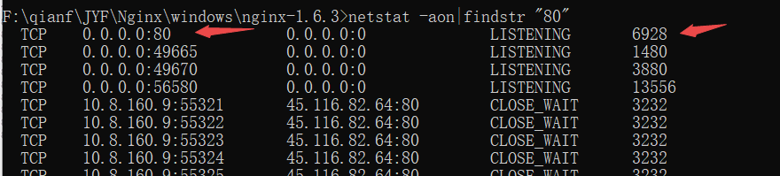

# Windows10

### 基本命令

```shell
net user # 当前系统用户有哪些
runas /user:username "cmd" # 命令行 用runas命令来切换用户
sc queryex type=service state=all # 查看服务
sc delete ServiceName # 删除服务
```


### look logs

```shell
# 一般用于查看Windows各种操作细节,例如postgreSQL数据库安装失败提示集群失败,就可以通过查看C:\Users\xxx\AppData\Local\Temp\installbuilder_installer_7556.log 安装日常了解.

C:\Users\xxx\AppData\Local\Temp # 日志路径 
```

### 炫酷设置

```tex
# 任务栏透明
1.win+R 输入regedit（也就是注册表）注意以管理员身份运行！
2.计算机\HKEY_CURRENT_USER\SOFTWARE\Microsoft\Windows\CurrentVersion\Explorer\Advanced
3.右侧空白处右键，选择新建→DWORD(32位)值
3.1.重命名此文件为 TaskbarAcrylicOpacity
4.双击文件名称，然后按照红圈设置。0为完全透明，10为完全不透明，中间的值可以自己调整以达到适合的透明度。
4.1.注意基数选择 十进制
```

### Windows进程管理

#### 关掉进程
如果你需要使用某个端口,但是该端口被占用了,那么你可以通过端口查询出pid然后杀掉进程端口也就释放了.
#### 通过端口查询
```shell
netstat -aon|findstr "80" #例如端口是80
```

#### 通过进程号结束进程
```shell
tasklist|findstr "6928"  #6928指的是上面查出来的进程号
