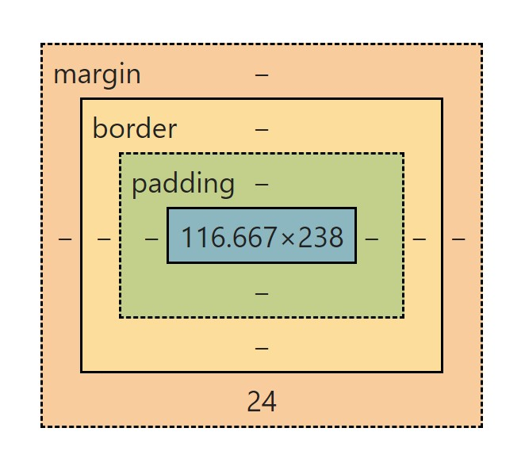

# HTML5

### 盒子模型



```text
+--------------------------------------------------+ →外边距离顶点  
|                       margin                     | →外边距  
|    +----------------------------------------+    | →内外边框(内边框:有自己的宽度,和内外边距类似)(外边框:紧贴内边框,并不是在外边距外围)  
|    |                  border                |    | 
|    |    +------------------------------+    |    |  
|    |    |              pading          |    |    | →内边距(以内边框作为锚点)  
|    |    |    +--------------------+    |    |    |  
|    |    |    |      content       |    |    |    | →内容宽高(字体,照片等)  
|    |    |    +--------------------+    |    |    |  
|    |    |                              |    |    |  
|    |    +------------------------------+    |    |  
|    |                                        |    |  
|    +----------------------------------------+    |  
|                                                  |  
+--------------------------------------------------+   
```

## Window

### 什么是窗口

在 HTML 和 CSS 中,窗口（Window）通常指的是浏览器窗口，也称为视口（Viewport）,它代表了用户在浏览器中看到网页内容的区域,

窗口的大小是由浏览器控制的，用户可以手动调整浏览器窗口的大小，同时网页内容也会相应地自动适应窗口大小进行显示。因此，在编写 HTML 和 CSS 代码时，我们通常会使用响应式设计的技术来确保网页在不同大小的窗口中都能正确地呈现和布局。

HTML 中,窗口通常是指 `<window>` 元素，但实际上，在` HTML 中并不存在直接定义窗口的元素`,相反，整个 HTML 文档被加载到浏览器窗口中,并被渲染成可见的网页内容

CSS 中,窗口可以通过 `width` 和 `height` 属性来设置窗口的宽度和高度

### 窗口和HTML的关系

窗口（Window）和 HTML 元素是两个概念上不同的实体。窗口指的是浏览器窗口，即用户通过浏览器看到网页内容的区域。而 HTML 元素是指 HTML 文档中的标签元素，例如 `<div>`、`<p>`、`` 等，其中每个元素都代表了一个具有特定功能和样式的可见或隐藏的网页部分。

虽然窗口和 HTML 元素是不同的实体，但它们之间是有联系的。具体来说，窗口可以影响 HTML 元素在页面中的可见性和布局方式，HTML 元素也可以在窗口中被渲染成可见的网页内容。下面列举几个例子：

- 窗口大小会决定 HTML 元素的可见区域：当用户缩小浏览器窗口时，只有部分 HTML 元素会显示在窗口的可见区域内；当用户扩大窗口时，则会有更多的 HTML 元素显示在窗口中。
- HTML 元素的大小和位置受窗口大小和分辨率的影响：用户在不同的设备、不同的分辨率和浏览器窗口大小下浏览网页时，同一组 HTML 元素可能会呈现出不同的大小和位置。
- 窗口也可以通过 JavaScript 操作 HTML 元素：开发人员可以使用 JavaScript 来获取和操作 HTML 元素的属性和样式，从而实现动态更新和交互效果。

总之，窗口和 HTML 元素在网页设计和开发中是密切相关的，它们共同构成了网页的可视化部分。
