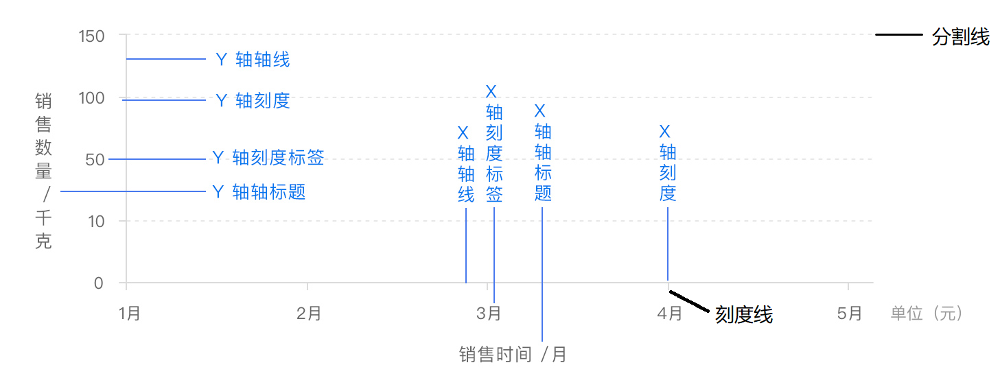
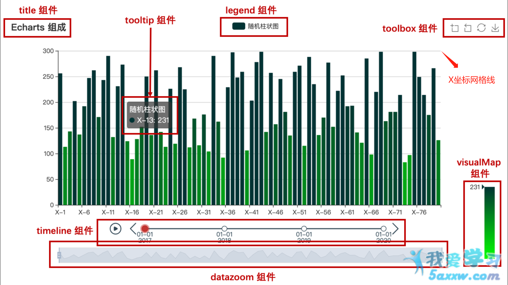
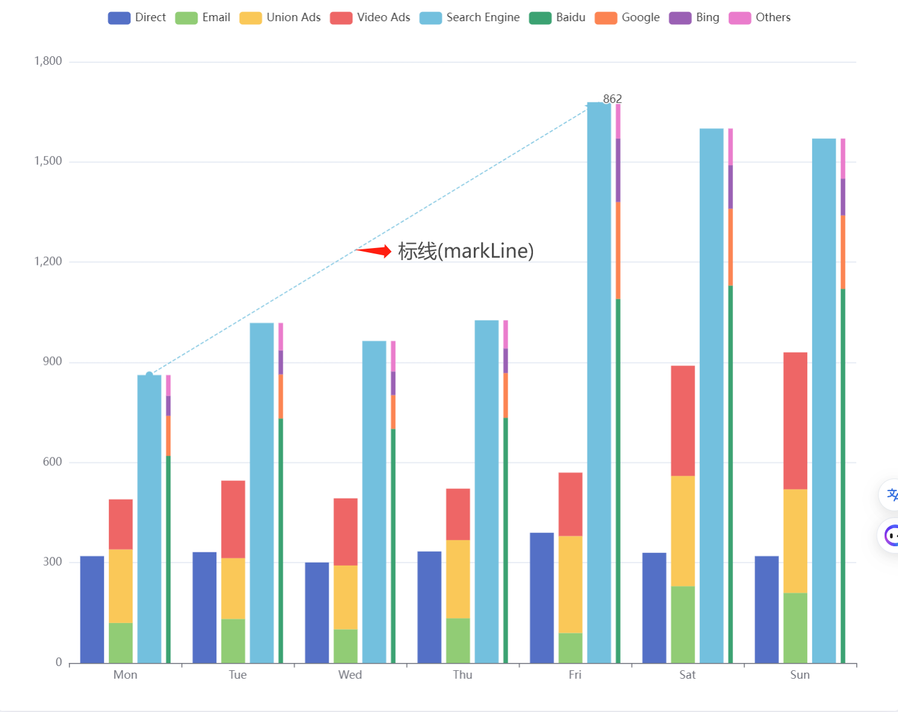
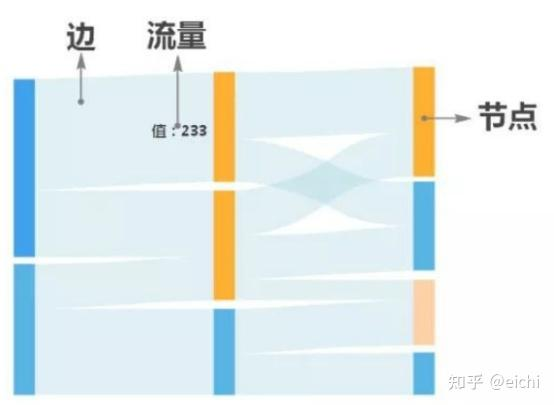

# ECharts
### 基本概念

#### 容器

容器（container）是图表展示的区域，可以是 div 元素或者画布（canvas）元素;

在使用 ECharts 时，容器是指用于承载图表的 HTML 元素。ECharts 会将图表渲染到指定的容器中，使其展示在网页上。

要创建一个容器供 ECharts 使用，可以在 HTML 中添加一个 `<div>` 元素，并为其设置一个唯一的 ID，作为容器的标识。例如：

```html
在 HTML 中，给容器元素添加一个样式类或内联样式，并通过 width 和 height 属性来指定容器的宽度和高度。

使用 html 创建容器并设置宽高
<div id="chart-container" style="width: 500px; height: 300px;"></div>
这样就将容器的宽度设置为 500 像素，高度设置为 300 像素。

使用 JavaScript 设置宽高
在 JavaScript 中，可以通过获取容器元素的引用，然后使用其 DOM 属性来设置宽度和高度。例如：
var container = document.getElementById('chart-container');
container.style.width = '500px';
container.style.height = '300px';
```

#### 初始化和重载

在使用 ECharts 的 JavaScript 代码中，需要获取这个容器元素的引用，并将其传递给 ECharts 的初始化函数。例如：

```javascript
var chartContainer = document.getElementById('chart-container'); // 获取DOM对象(容器)

var myChart = echarts.init(chartContainer); // 初始化

myChart.setOption(option,true); // 渲染图表,参数1_图表配置项,参数2_每次调用时新的配置项是否覆盖原有配置项中存在的同名属性，其他属性则会保留原有的配置.

myChart.clear(); // 清除图表实例中已有的内容,包括所有的系列和数据,释放内存空间,并将实例重置为未初始化状态,在清除完成后，可以使用 setOption(option,true) 方法重新加载新的配置项并绘制图表.

myChart.resize(); //方重新调整图表的尺寸以适应容器的变化,当小改变时,特别是在响应式布局或动态调整容器大小的情况下,使用该方法可以确保图表的尺寸与容器相匹配.

```

#### 图表

图表（chart）是由多个元素组成的可视化图形，例如柱状图、散点图、饼图等;

在 ECharts 中，图表是指通过数据和配置项进行描述的可视化图形。ECharts 支持多种类型的图表，包括但不限于折线图、柱状图、饼图、散点图、雷达图等。

要创建一个图表，需要使用 ECharts 的 JavaScript API，并将图表的数据和配置项传递给相应的函数。下面以柱状图为例，介绍创建图表的一般步骤：

```javascript
// 引入 ECharts 库：
// 在 HTML 文件中引入 ECharts 的 JavaScript 库文件：
<script src="https://cdn.jsdelivr.net/npm/echarts@5.2.1/dist/echarts.min.js"></script>
// vue3项目中JavaScript引入ECharts:
import * as echarts from 'docs/FrontFnd/VueEcology/ECharts/ECharts';

// 准备容器：在 HTML 中创建一个容器元素，用于承载图表的展示：
<div id="chart-container" style="width: 500px; height: 300px;"></div>

// 获取容器引用：使用 JavaScript 获取容器元素的引用：
var chartContainer = document.getElementById('chart-container');

// 初始化图表实例：通过 echarts.init 方法初始化一个图表实例，并将容器引用传递给它：
var chart = echarts.init(chartContainer);

// 配置图表：创建一个配置项对象，其中包含图表的类型（如 'bar' 表示柱状图）、数据、样式等信息：
var option = {
    // 图表类型
    type: 'bar',
    // 数据
    data: [10, 20, 30, 40, 50],
    // 其他配置项...
};

// 渲染图表：通过调用图表实例的 setOption 方法，将配置项应用到图表中，并渲染图表：
chart.setOption(option, true);
```

#### 元素

元素（element）是图表中的一个基本单元，例如坐标轴、系列、标签、数据等；

##### 坐标轴（Axis）

用于定义图表的坐标系和刻度

使用 `xAxis` 和 `yAxis` 配置项来定义一个分类（category）类型的 x 轴和一个数值（value）类型的 y 轴

```javascript
javascript复制代码option = {
  xAxis: {
    type: 'category',
    data: ['A', 'B', 'C', 'D'],
    axisLine: {
      lineStyle: {
        color: 'red', // X轴线颜色
        width: 2, // X轴线宽度
        type: 'dashed' // X轴线类型（实线/虚线）
      }
    },
    axisTick: {
      show: false, // 显示刻度线
      alignWithLabel: true, // 刻度线与标签对齐
      lineStyle: {
      color: 'red', // 刻度线颜色
      width: 2 // 刻度线宽度
      }
    },
  },
  yAxis: {
    type: 'value',
    splitLine: {
      show: true, // 是否显示分隔线
      lineStyle: {
        color: '#ddd', // 分隔线颜色
        width: 1, // 分隔线宽度
        type: 'dashed', // 分隔线类型
        opacity: 0.5, // 分隔线不透明度
      },
    },
  }
};
```

##### 系列（Series）

定义和配置图表中具体的数据系列（例如折线、柱状、饼图等）

使用 `series` 配置项定义了一个柱状图（bar）系列，该系列的数据为 [10, 20, 30, 40]

```javascript
javascript复制代码option = {
  series: [{
    padding: [10, 10, 10, 10], //饼图无效
    type: 'bar',
    data: [10, 20, 30, 40]
  }]
};
```

##### 标签（Label）

在图表上显示数据标签，辅助数据展示

使用 `label` 配置项将饼图（pie）系列的标签显示在图形内部，并设置其他相关样式

```javascript
javascript复制代码option = {
  series: [{
    type: 'pie',
    left: "-50%" , // 设置标签与扇区外边的距离
    data: [
      { value: 335, name: 'A' },
      { value: 310, name: 'B' },
      { value: 234, name: 'C' },
      { value: 135, name: 'D' }
    ],
    label: {
      show: true,
      position: 'inside'
    }
  }]
};
```

##### 数据（Data）

使用 `data` 配置项定义了折线图（line）系列的数据为 `[10, 20, 30, 40]`，并通过 `symbolSize` 函数来控制数据点的大小

```javascript
javascript复制代码option = {
  series: [{
    type: 'line',
    data: [10, 20, 30, 40],
    symbolSize: function (data) {
      return Math.sqrt(data);
    }
  }]
};
```

##### 网格(grid)

```text
show: 是否显示网格，默认为 true。
borderColor: 网格边框颜色，默认为 '#ccc'。
borderWidth: 网格边框宽度，默认为 0。
backgroundColor: 网格背景色，默认为 'transparent'。
containLabel: 网格是否包含坐标轴标签（即是否将坐标轴标签计算在内），默认为 false。
left: 网格左侧的距离，默认为 '10%'。
right: 网格右侧的距离，默认为 '10%'。
top: 网格顶部的距离，默认为 '60'。
bottom: 网格底部的距离，默认为 '40'。
z: 网格所在的 z 轴层级，默认为 0。
zlevel: 网格所在的 Canvas 分层，默认为 0。
shadowBlur: 网格阴影的大小，默认为 0。
shadowColor: 网格阴影的颜色，默认为 'transparent'。
shadowOffsetX: 网格阴影的水平偏移量，默认为 0。
shadowOffsetY: 网格阴影的垂直偏移量，默认为 0。
tooltip: 鼠标悬浮时的提示框。
```


##### 标题和副标题（Title and Subtitle）

用于给图表添加标题和副标题

```javascript
javascript复制代码option = {
  title: {
    text: '图表标题',
    subtext: '图表副标题'
  }
};
```

##### 图例（Legend）：

用于展示不同系列数据的标记和名称，帮助区分数据

```javascript
javascript复制代码option = {
  legend: {
    data: ['系列A', '系列B']
  },
  series: [
    {
      name: '系列A',
      // ...
    },
    {
      name: '系列B',
      // ...
    }
  ]
};
```

##### 工具箱（Toolbox）：

提供一些常用的操作工具，例如导出图表、数据视图等

```javascript
javascript复制代码option = {
  toolbox: {
    feature: {
      saveAsImage: {},
      dataView: {}
    }
  }
};
```

##### 提示框（Tooltip）

在鼠标悬停时显示数据信息的弹出框

```javascript
javascript复制代码option = {
  tooltip: {
    trigger: 'axis'
  },
  // ...
};
```

##### 视觉映射组件（VisualMap）

将数据映射到视觉元素上，例如颜色或大小等

```javascript
javascript复制代码option = {
  visualMap: {
    type: 'continuous',
    min: 0,
    max: 100,
    color: ['green', 'red']
  },
  series: [
    {
      type: 'heatmap',
      data: // ...
    }
  ]
};
```
### 刻度图


### 柱状图

### 堆叠图


### 桑基图


### 在顶部标题标签上添加特殊字符

```typescript
series: [
  {
    type: 'bar',
    label: {//图标顶部显示数据标签
      show: true,
      // 在数据值后添加%
      formatter: function (params) {
        return params.data[params.seriesName].toFixed(2) + '%';
        //params.data代表当前柱形图数据项的对象，params.seriesName代表当前系列的名称。
        // 通过params.data[params.seriesName]获取到对应的数值，然后使用toFixed(2)方法将数值保留两位小数。
        // 最后，通过字符串拼接的方式将百分号符号添加到数值的末尾，得到形如"xx.xx%"的百分比格式字符串。
      },
      position: "top"
    }
  }
]
```

### 在刻度标签上添加特殊符号

```typescript
xAxis: { 
  name: 'amount',
  position:"left",
  axisLabel:{
    formatter:"{value} m³",
   // formatter:"{c} m³", 
  }
},
```


### 饼图

```javascript
// 上、右、下、左的内边距,由于饼图的布局方式不是基于盒子模型的，因此设置 padding 并不会影响饼图与容器之间的距离。
padding: [10, 10, 10, 10], 
```


### 常见问题

```javascript
series.data.itemStyle.color:rgb(666 666 66)  // 此处使用rgb会导致饼图鼠标悬停时图表变成透明色(消失不见)并且选中产生抖动

// 通过监听窗口大小改变事件来实现图表的大小自适应
window.onresize = function () {
    chart.resize();//重置容器宽高
};
window.addEventListener('resize', function(){ //兼容性更佳
  // 调整图表大小
  chart.resize();
});
#chart {
  overflow-x: hidden; /* 禁止横向滚动条 */
  width: 100%; /* 宽度占满容器 */
}
      
```


