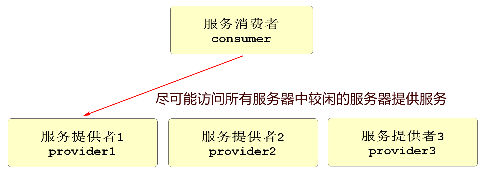

# Dubbo

## Dubbo服务调用

RPC框架,依赖于注册表和负载平衡,Dubbo也支持其它软件作为注册中心(例如Redis,zookeeper等)和多种传输协议（Dubbo、RMI、HTTP、redis等）,您可以根据业务场景选择最佳方式,非常灵活。

默认Dubbo协议：采用netty、TCP传输,单点、异步、长连接，适合数据量小、并发性高且服务提供商远少于消费者的场景,相比openfeign有更高的灵活性和并发能力.

### 依赖

```xml
<!--在父项目中定义版本号信息-->
<properties>
    <spring-cloud.version>2020.0.3</spring-cloud.version>
    <spring-cloud-alibaba.version>2.2.2.RELEASE</spring-cloud-alibaba.version>
</properties>

<!-- Spring Cloud Alibaba锁版本 -->
<dependencyManagement>
    <dependencies>
        <!-- Spring Cloud Alibaba -->
        <dependency>
            <groupId>com.alibaba.cloud</groupId>
            <artifactId>spring-cloud-alibaba-dependencies</artifactId>
            <version>${spring-cloud-alibaba.version}</version>
            <type>pom</type>
            <scope>import</scope>
        </dependency>
    </dependencies>
</dependencyManagement>

<!-- Dubbo的依赖 -->
<dependency>
    <groupId>com.alibaba.cloud</groupId>
    <artifactId>spring-cloud-starter-dubbo</artifactId>
</dependency>
```

### 配置文件

```yaml
spring:
  dubbo:
  protocol:
    #port设置-1表示当前dubbo端口号支持自动生成
    #生成规则是从20880开始寻找可用的端口号,如果当前端口号被占用就会自动+1直到直到可用为止
    port: -1
    #设置连接名称,一般固定为dubbo即可
    name: dubbo
  registry:
    #声明当前的dubbo的注册中心类型和位置
    address: nacos://localhost:8848
  consumer:
     # 当本项目启动时,是否检查当前项目需要的所有Dubbo服务是否是可用状态
     # 我们设置它的值为false,表示项目启动时不检查,所需的服务是否可用
    check: false
    timeout: 50000              
```


### @DubboService

```java
// @DubboService注解标记在业务逻辑层实现类上,表示其中的所有方法都会注册到Nacos,在其他服务启动"订阅"时,就会"发现"当前类中的所有服务(业务逻辑层方法),并表示允许被调用
@DubboService 
@Service
@Slf4j
public class StockServiceImpl implements IStockService {
    //内容略....
}
```

### @EnableDubbo

``` java
// 添加注解后,当前项目的所有服务才能正确发布到Nacos中!
// 单纯的消费者不需要添加
@EnableDubbo
public class CsmallStockWebapiApplication {
    public static void main(String[] args) {
        SpringApplication.run(CsmallStockWebapiApplication.class, args);
    }
}
```

### @DubboReference

``` java
@Service
@Slf4j
public class OrderServiceImpl implements IOrderService {
    
    //用法 和@Autowired 装配类似,只不过来源不一样
    @Autowired
    private OrderMapper orderMapper;

    // 添加@DubboReference注解,表示当前业务逻辑层要消费其他模块的服务
    // 可以编写当前Nacos中注册的其他业务模块的逻辑层接口
    // 因为Nacos中注册了业务的实现类,所以声明的接口会自动匹配到实现类对象
    // 先添加stock模块的业务逻辑层接口,在添加cart模块
    @DubboReference
    private IStockService dubboStockService;
    /**
    注意:消费者在调用生产者模块时需先在pom.xml中添加该模块的依赖
    <dependency>
            <groupId>cn.tedu</groupId>
            <artifactId>csmall-order-service</artifactId>
            <version>0.0.1-SNAPSHOT</version>
    </dependency>
    */
    @DubboReference
    private ICartService dubboCartService;

    @Override
    public void orderAdd(OrderAddDTO orderAddDTO) {
        // 1.减少订单中商品的库存数(要调用stock模块的功能)
        // 实例化减少库存业务的DTO对象
        StockReduceCountDTO countDTO=new StockReduceCountDTO();
        countDTO.setCommodityCode(orderAddDTO.getCommodityCode());
        countDTO.setReduceCount(orderAddDTO.getCount());
        // 执行dubbo调用完成stock模块减少库存的方法
        dubboStockService.reduceCommodityCount(countDTO);
        // 2.从购物车中删除订单中选择中的商品(要调用cart模块的功能)
        dubboCartService.deleteUserCart(orderAddDTO.getUserId(),
                                        orderAddDTO.getCommodityCode());

        // 3.将orderAddDTO中的信息新增到数据库订单表中
        // 要将orderAddDTO对象中的属性赋值给Order类型对象的同名属性
        Order order=new Order();
        BeanUtils.copyProperties(orderAddDTO,order);
        // 执行新增
        orderMapper.insertOrder(order);
        log.info("新增订单信息为:{}",order);
    }
}
```

### 理论小结

Dubbo生产者消费者相同的配置,pom文件需要添加dubbo依赖,yml文件配置dubbo信息

**生产者**

* 要有service接口项目
* 提供服务的业务逻辑层实现类要添加@DubboService注解
* SpringBoot启动类要添加@EnableDubbo注解

**消费者**

* pom文件添加消费模块的service依赖
* 业务逻辑层远程调用前,模块使用@DubboReference注解获取业务逻辑层实现类对象


### Dubbo内置负载均衡

在实际项目中,一个服务基本都是集群模式的,也就是多个功能相同的项目在运行,这样才能承受更高的并发,这时一个请求到这个服务,就需要确定访问哪一个服务器,Dubbo框架内部支持负载均衡(Loadbalance)算法,能够尽可能的让请求在相对空闲的服务器上运行,在不同的项目中,可能选用不同的负载均衡策略,以达到最好效果


### 随机分配策略

**random loadbalance:**随机分配策略(默认),假设我们当前3台服务器,经过测试它们的性能权重比值为5:3:1,下面可以生成一个权重模型


随机生成随机数,在哪个范围内让哪个服务器运行

**优点:**算法简单,效率高,长时间运行下,任务分配比例准确

**缺点:**偶然性高,如果连续的几个随机请求发送到性能弱的服务器,会导致异常甚至宕机

### 权重平滑分配

**round Robin Loadbalance:**权重平均分配,如果几个服务器权重一致,那么就是依次运行,但是服务器的性能权重一致的可能性很小,所以我们需要权重平滑分配,一个优秀的权重分配算法,应该是让每个服务器都有机会运行的,如果一个集群服务器性能比为5:3:1服务为A,B,C

1→A  2→A  3→A  4→A  5→A

6→B  7→B  8→B

9→C

上面的安排中,连续请求一个服务器肯定是不好的,我们希望所有的服务器都能够穿插在一起运行,Dubbo2.7之后更新了这个算法使用"**平滑加权算法**"优化权重平均分配策略


**优点:**能够尽可能的在权重要求的情况下,实现请求的穿插运行(交替运行),不会发生随机策略中的偶发情况

**缺点:**服务器较多时,可能需要减权和复权的计算,需要消耗系统资源

### 活跃度自动感知

**leastactive Loadbalance:**活跃度自动感知分配,记录每个服务器处理一次请求的时间,按照时间比例来分配任务数,运行一次需要时间多的分配的请求数较少

### 一致性Hash算法

**consistanthash Loadbalance:**一致性hash算法分配,根据请求的参数进行hash运算,以后每次相同参数的请求都会访问固定服务器,因为根据参数选择服务器,不能平均分配到每台服务器上,使用的也不多
