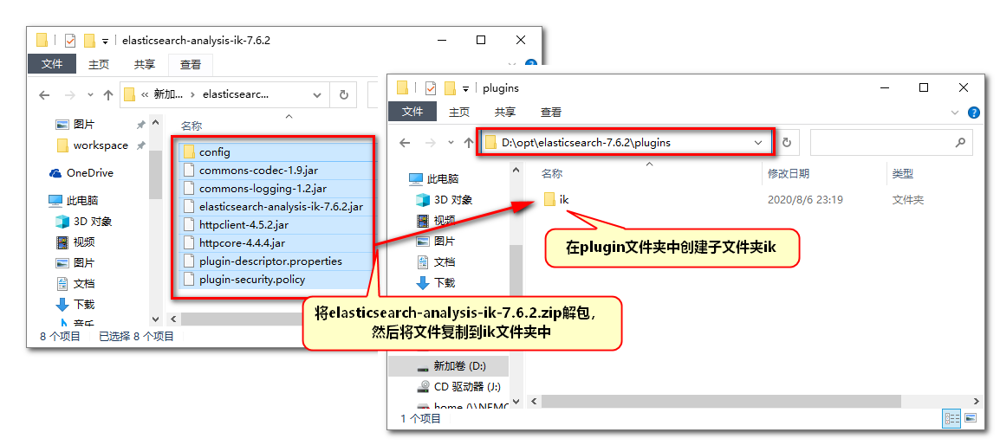

#  ElasticSearch


elastic:富有弹性的,search:搜索,我们可以把它简称为ES,但是搜索它的资料时(例如百度)还是使用Elasticsearch关键字进行搜索更准确,**这个软件不再是SpringCloud提供的,它也不是专门针对微服务环境的项目来开发**,Elasticsearch和redis\mysql一样,它本质就是一个java项目,但又不仅服务于java语言,其它语言也可以使用,它的功能也类似一个数据库,能高效的从大量数据中搜索匹配指定关键字的内容,它也将数据保存在硬盘中,这样的软件有一个名称**全文搜索引擎**,使用它进行数据的增删改查就是访问这个项目的控制器方法(url路径),**ES底层技术使用了java的一套名为Lucene的API**,这个API提供了全文搜索引擎核心操作的接口,相当于搜索引擎的核心支持,ES是在Lucene的基础上进行了完善,实现了开箱即用的搜索引擎软件,市面上和ES功能类似的软件有,Solr/MongoDB

```ABAP
启动: D:\Databases\Elasticsearch-7.6.2\bin\elasticsearch.bat
默认端口: 9200
控制台网址: http://localhost:9200
官网: https://
```

**为什么需要Elasticsearch: **

数据库进行模糊查询效率严重低下,所有关系型数据库都有这个缺点(mysql\mariaDB\oracle\DB2等),在执行类似下面模糊查询时

```sql
select * from spu where spu_name like '%鼠标%'
```

测试证明**一张千万级别的数据表进行模糊查询需要20秒以上**,当前互联网项目要求"三高"的需求下,这样的效率肯定不能接受,Elasticsearch主要是为了解决数据库模糊查询性能低下问题的,ES进行优化之后,从同样数据量的ES中查询相同条件数据,效率能够提高100倍以上

**数据库索引简介:**

所谓的索引(index)其实就是数据目录,通常情况下,索引是为了提高查询效率的,数据库索引分两大类

**聚集索引**就是数据库保存数据的物理顺序依据,默认情况下就是主键id,所以按id查询数据库中的数据效率非常高

**非聚集索引**:如果想在非主键列上添加索引,就是非聚集索引了

例如我们在数据库表中存在一个姓名列,我们为姓名列创建索引,在创建索引时,会根据姓名内容来创建索引,例如"张三" 这个姓名,创建索引后查询效率就会明显提升,如果没有索引,这样的查询就会引起效率最低的"逐行搜索",就是一行一行的查这个数据的姓名是不是张三,效率就会非常低,模糊查询时因为'%鼠标%',使用的是前模糊条件,使用索引必须明确前面的内容是什么,前模糊查询是不能使用索引的,只能是全表的逐行搜索,所以效率非常低,当我们项目中设计了根据用户输入关键字进行模糊查询时,需要使用**全文搜索引擎**来优化

> **索引面试题**
>
> 1.创建的索引会占用硬盘空间
>
> 2.创建索引之后,对该表进行增删改操作时,会引起索引的更新,所以效率会降低
>
> 3.对数据库进行批量新增时,先删除索引,增加完毕之后再创建
>
> 4.不要对数据样本少的列添加索引
>
> 5.模糊查询时,查询条件前模糊的情况,是无法启用索引的
>
> 6.每次从数据表中查询的数据的比例越高,索引的效果越低
>
> 7.当我们执行查询时,where条件后应该先查询有索引的列

**运行原理:**

要想使用ES提高模糊查询效率,首先要将数据库中的数据复制到ES中,在新增数据到ES的过程中,ES可以对指定的列进行分词索引保存在索引库中,形成倒排索引结构


**启动:**

课程中使用7.6.2的版本,压缩包280M左右,复制到没有中文,没有空格的目录下解压**双击bin\elasticsearch.bat**运行

启动后的dos界面不能关闭,一旦关闭ES就停止了,验证ES的运行状态,浏览器输入地址:localhost:9200看到如下内容即可

mac系统启动

```
tar -xvf elasticsearch-7.6.2-darwin-x86_64.tar.gz 
cd elasticsearch-7.6.2/bin 
./elasticsearch
```

linux:

```
tar -xvf elasticsearch-7.6.2-linux-x86_64.tar.gz
cd elasticsearch-7.6.2/bin
./elasticsearch
```

**基本使用:**

ES启动完成后,我们要学习如何操作它,我们已经讲过,操作ES是对ES发送请求,我们创建一个子项目search,在这个子项目中创建一个专门发送各种类型请求的文件来操作ES,创建search项目也要父子相认,然后子项目pom文件如下

### 依赖

```xml
<!-- search项目 -->

    <!-- 在父项目中定义版本号信息 -->
    <properties>
        <spring-boot.version>2.5.4</spring-boot.version>
    </properties>

    <!-- 锁版本 -->
    <dependencyManagement>
        <dependencies>
                <!-- Spring Boot：基础框架 -->
                <dependency>
                    <groupId>org.springframework.boot</groupId>
                    <artifactId>spring-boot-starter</artifactId>
                    <version>${spring-boot.version}</version>
                </dependency>
                <!-- Spring Boot Test：测试 -->
                <dependency>
                    <groupId>org.springframework.boot</groupId>
                    <artifactId>spring-boot-starter-test</artifactId>
                    <version>${spring-boot.version}</version>
                    <scope>test</scope>
                </dependency>
                <!-- Spring Boot Data Elasticsearch：文档搜索 -->
                <dependency>
                    <groupId>org.springframework.boot</groupId>
                    <artifactId>spring-boot-starter-data-elasticsearch</artifactId>
                    <version>${spring-boot.version}</version>
                </dependency>
        </dependencies>
    </dependencyManagement>

    <!-- Search相关依赖 -->
    <dependencies>
        <!-- Spring Boot：基础框架 -->
        <dependency>
            <groupId>org.springframework.boot</groupId>
            <artifactId>spring-boot-starter</artifactId>
        </dependency>
        <!--  为了方便测试添加测试依赖  -->
        <dependency>
            <groupId>org.springframework.boot</groupId>
            <artifactId>spring-boot-starter-test</artifactId>
        </dependency>
        <!--  spring data elasticsearch 依赖   -->
        <dependency>
            <groupId>org.springframework.boot</groupId>
            <artifactId>spring-boot-starter-data-elasticsearch</artifactId>
        </dependency>
    </dependencies>
```

### 请求文件

删除test文件夹,下面创建一个能够向ES发送请求的文件,这种能够向指定url发送请求的文件格式称之为http client(http 客户端)

文件类型叫HTTP Request文件,我们可以起名为elasticsearch,我们先从最简单的请求开始,向es发送指令

```json
### 三个#是注释,也是分隔符,每个请求编写前必须使用###与上个请求分隔
GET http://localhost:9200

### 测试ES的分词功能,运行分词,查看分词结果
POST http://localhost:9200/_analyze
Content-Type: application/json

{
  "text": "my name is hanmeimei",
  "analyzer": "standard"
}
```

analyze:分析,analyzer:分析者(分词器),standard是ES默认的分词器,"analyzer": "standard"是可以省略的,standard这个分词器只能对英文等西文字符(有空格的),进行正确分词,但是中文分词不能按空格分,按这个分词器分词,每个字都会形成分词,这样的结果不能满足我们日常的搜索需要

### ik分词插件

我们解决中文不能正确分词的问题,实际上要引入一个中文常见词语的词库,分词时按照词库中的词语分词即可,我们可以使用免费的中文分词器词库插件IK来实现中文分词效果

安装插件之后要重启ES才能生效,ES启动之后,将中文分词器设置完成,在运行分词

```json
{
  "text": "罗技激光无线游戏鼠标",
  "analyzer": "ik_smart"
}
```

再次运行分词测试,应该看到正常的中文分词效果,但是词库的容量有限,比较新的网络名词和较新出现的人名是不在词库中的,我们**安装的ik实际上不只一个分词器,实际上除了ik_smart之外还有ik_max_word**

```json
POST http://localhost:9200/_analyze
Content-Type: application/json

{
  "text": "北京冬季奥林匹克运动会顺利闭幕",
  "analyzer": "ik_smart"
}
```

```json
POST http://localhost:9200/_analyze
Content-Type: application/json

{
  "text": "北京冬季奥林匹克运动会顺利闭幕",
  "analyzer": "ik_max_word"
}
```

上面的两个分词器运行分词,结果会有非常明显的区别

**总结区别如下**

**ik_smart**

* 优点:特征是粗略快速的将文字进行分词,占用空间小,查询速度快

* 缺点:分词的颗粒度大,可能跳过一些重要分词,导致查询结果不全面,查全率低

**ik_max_word**

* 优点:特征是详细的文字片段进行分词,查询时查全率高,不容易遗漏数据
* 缺点:因为分词太过详细,导致有一些无用分词,占用空间较大,查询速度慢

**操作数据:**

**ES是一个数据库性质的软件**,可以执行增删改查操作,只是他操作数据不使用sql,数据的结构和关系型数据库也不同

* ES启动后,ES服务可以创建多个index(索引),index可以理解为数据库中表的概念

* 一个index可以创建多个保存数据的document(文档),一个document理解为数据库中的一行数据
* 一个document中可以保存多个属性和属性值,对应数据库中的字段(列)和字段值
