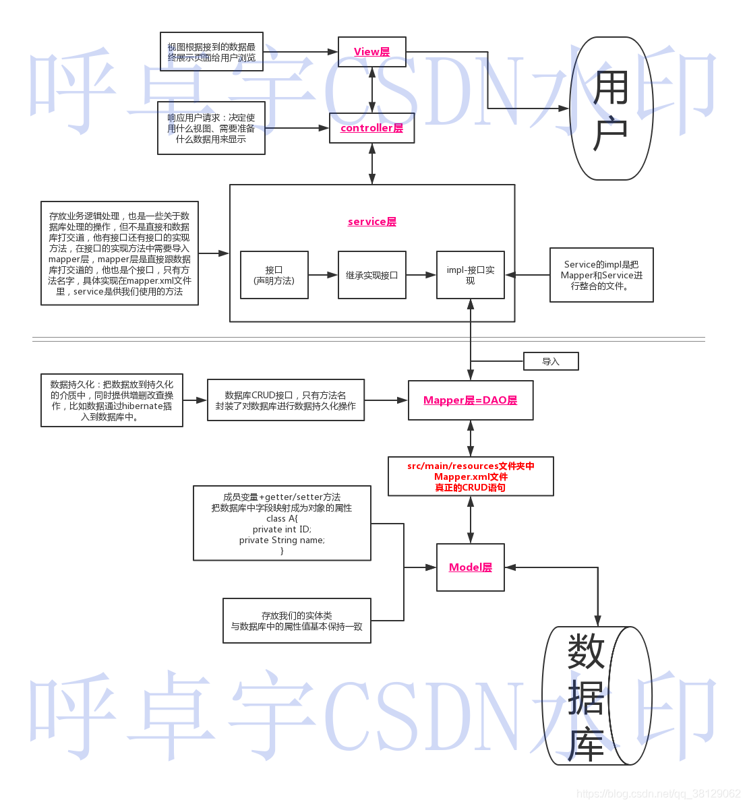

# MVC和SSM


### 各层的名词含义

```
SSM即Sping+SpringMVC+Mybatis集成的框架。
MVC即Model View Controller。
```

**pojo**全称为：Plain Ordinary Java Object，即简单普通的java对象。一般用在数据层映射到数据库表的类，类的属性与表字段一一对应。

**mapper→dao**:即持久层

**dto**:全称为:Data Transfer Object，即数据传输对象(例如java项目测试的时候使用)

作为查询操作所需要查询的字段的封装对象

一般用于向数据层外围提供仅需的数据，如查询一个表有50个字段，界面或服务只需要用到其中的某些字段，DTO就包装出去的对象。可用于隐藏数据层字段定义，也可以提高系统性能，减少不必要字段的传输损耗。

**vo**全称为：Value Object，有的也称为View Object，即值对象或页面对象。一般用于web层向view层封装并提供需要展现的数据(例如传给前端的json数据。

**entity→model**

