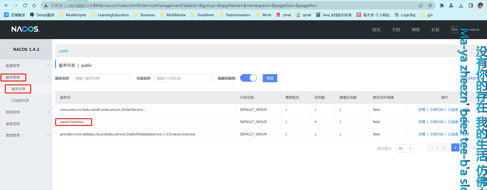

# Nacos

SpringCloud注册中心除了可以使用Nacos实现外,还可以用 Redis/zookeeper等实现相同的功能

- 命名空间:public/dev/prod...默认新增所有配置都在public,通常采用的是每个微服务配置自己的空间使用分组区分环境
- 配置分组:默认搜友的配置集都数据DEFAULT_GROUP,可自定义dev,prod等
- 配置集(data ID):类似文件名,每个yaml文件
-

### Download


### Install


### Start

#### Windows

```ABAP
启动命令:"D:\Spring\SpringCloud\nacos-server-1.4.2\bin\目录下": startup.cmd -m standalone
```

### Linux

```ABAP

```

#### IDEA:Shell Script

```ABAP
Script path:D:\DevelopmentKit\Nacos-2.1.0\bin\startup.cmd
Script options:-m standalone
working directory:E:/DevelopmentKitData/JetBrains/IDEA/Projects/MuyiMall
```

### 注册中心

#### Depend

```xml
<!-- 支持项目注册到Nacos注册中心的依赖  discovery发现(微服务的发现) -->
<dependency>
    <groupId>com.alibaba.cloud</groupId>
    <artifactId>spring-cloud-starter-alibaba-nacos-discovery</artifactId>
    <!--<version>${spring-cloud-alibaba.version}</version>-->
    <!--<version>2022.0.0.0-RC1</version>-->
</dependency>
```

#### Configuration

```yaml
spring:
  application:
    # 为当前项目起名,这个名字会被Nacos收集,并显示在注册列表中
    name: muyimall-business
  cloud:
    nacos:
      discovery:
        # 配置Nacos的位置,用于当前项目连接
        server-addr: localhost:8848
        # ephemeral设置当前项目启动时注册到nacos的类型 true(默认):临时实例 false:永久实例
        ephemeral: false
```

#### @EnableDiscoveryClient

```java
@EnableDiscoveryClient //Nacos 开启注册发现功能
@SpringBootApplication
public class TianqvmallCouponApplication {
    public static void main(String[] args) {
        SpringApplication.run(MuyiMallCouponApplication.class, args);
    }
}
```

### 配置中心

#### Dependency

```xml
<dependency>
    <groupId>com.alibaba.cloud</groupId>
    <artifactId>spring-cloud-starter-alibaba-nacos-config</artifactId>
    <version>${spring-cloud-alibaba.version}</version>
</dependency>
```

#### Configuration

```properties
# bootstrap.properties : 优先于application.properties加载

# 当前应用名字
spring.application.name=muyimall-coupon
# 设置Nacos配置中心的地址
spring.cloud.nacos.config.server-addr=127.0.0.1:8848
# 把默认加载public命名空间替换为coupon
spring.cloud.nacos.config.group=coupon
# 指定Nacos配置中心数据集命名空间ID
spring.cloud.nacos.config.namespace=ea7a4f6b-0fc5-4836-8618-b6b581fb35a3

#   配置多配置集

# 指定数据源id(通常类文件名)
spring.cloud.nacos.config.extension-configs[0].data-id=application.yml
# coupon命名空间下dev分组id
spring.cloud.nacos.config.extension-configs[0].group=dev
# 设置动态刷新(默认false)
spring.cloud.nacos.config.extension-configs[0].refresh=true

spring.cloud.nacos.config.extension-configs[1].data-id=datasource.yml
spring.cloud.nacos.config.extension-configs[1].group=dev
spring.cloud.nacos.config.extension-configs[1].refresh=true

spring.cloud.nacos.config.extension-configs[2].data-id=mybatis.yml
spring.cloud.nacos.config.extension-configs[2].group=dev
spring.cloud.nacos.config.extension-configs[2].refresh=true
```

#### @RefreshScope

```java
@RefreshScope  //从Nacos配置中心动态获取配置信息
@RestController
@RequestMapping("coupon/coupon")
public class CouponController {
    // ......
}
```

#### @Value

```java
@RefreshScope
@RestController
@RequestMapping("coupon/coupon")
public class CouponController {

    @Autowired
    private CouponService couponService;

    @Value("${coupon.user.name}")   //从配置中动态获取某个属性的值
    private String name;
    @Value("${coupon.user.age}")
    private Integer age;
    @RequestMapping("/test")
    public R test() {
        return R.ok().put("name", name).put("age", age);
    }
}
```

### Console

``` ABAP
控制台网址: http://localhost:8848/nacos
默认账号: nacos
默认密码: nacos
```

启动Nacos然后启动需要注册的Java模块后登录进Nacos后台在**服务管理->服务列表**中,能看到(例如nacos-business)的名称


