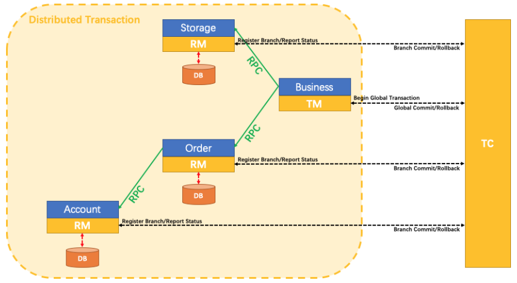

# Seata

Seata(分布式全局事务) 是一款开源的分布式事务解决方案，致力于在微服务架构下提供高性能和简单易用的**分布式事务**服务,也是Spring Cloud Alibaba提供的组件,在微服务的项目中,业务逻辑层涉及远程调用,当前模块发生异常,无法操作远程服务器回滚这时要想让远程调用也支持事务功能,就需要使用分布式事务组件Seata.

它能够保证一个业务中所有对数据库的操作要么都成功,要么都失败,来保证数据库的数据完整性,但是在微服务的项目中,业务逻辑层涉及远程调用,当前模块发生异常,无法操作远程服务器回滚,这时要想让远程调用也支持事务功能,就需要使用分布式事务组件Seata,官方文档:https://seata.io/zh-cn'

>seata也是java开发的,启动方式和nacos很像,它要求配置环境变量中Path属性值有java的bin目录路径

``` ABAP
启动:D:\Spring\SpringCloud\seata-server-1.4.2\bin>
seata-server.bat -h 127.0.0.1 -m file
默认端口:8091
```

### 依赖

``` xml
<!--在父项目中定义版本号信息-->
<properties>
    <seata-server.version>1.4.2</seata-server.version>
    <pagehelper-spring-boot.version>1.4.0</pagehelper-spring-boot.version>
    <fastjson.version>1.2.45</fastjson.version>
</properties>

<!-- 锁版本 -->
<dependencyManagement>
    <dependencies>
        <!--seata整合springboot-->
            <dependency>
                <groupId>io.seata</groupId>
                <artifactId>seata-spring-boot-starter</artifactId>
                <version>${seata-server.version}</version>
            </dependency>
        <!-- PageHelper Spring Boot：MyBatis分页 -->
            <dependency>
                <groupId>com.github.pagehelper</groupId>
                <artifactId>pagehelper-spring-boot-starter</artifactId>
                <version>${pagehelper-spring-boot.version}</version>
            </dependency>
        <!-- Alibaba FastJson -->
            <dependency>
                <groupId>com.alibaba</groupId>
                <artifactId>fastjson</artifactId>
                <version>${fastjson.version}</version>
            </dependency>
    </dependencies>
</dependencyManagement>

<!-- Seata及相关依赖 -->
<dependency>
	<groupId>io.seata</groupId>
	<artifactId>seata-spring-boot-starter</artifactId>
</dependency>
<!-- Seata 完成分布式事务的两个相关依赖(Seata会自动使用其中的资源) -->
<dependency>
	<groupId>com.github.pagehelper</groupId>
	<artifactId>pagehelper-spring-boot-starter</artifactId>
</dependency>
<dependency>
	<groupId>com.alibaba</groupId>
	<artifactId>fastjson</artifactId>
</dependency>
```

### 配置文件

``` yaml
seata:
  tx-service-group: csmall_group # 定义事务分组名称,一般是以项目为单位的,可以与其他项目区分
  service:
    vgroup-mapping:
      csmall_group: default      # csmall_group分组使用Seata默认的配置完成事务
    grouplist:
      default: localhost:8091    # 配置Seata服务器的地址和端口号信息(8091是默认端口号)
      
    # 注意: 同一个事务必须在同一个tx-service-group中,同时指定相同的seata地址和端口
```

> 事务的4个特性:ACID特性
>
> - 原子性
> - 一致性
> - 隔离性
> - 永久性

### 典型模块调用事务模型

> 观察下面比较典型的远程调用事务模型结构
>
> 

如果account操作数据库失败需要让order模块和storage模块撤销(回滚)操作,声明式事务不能完成这个操作,**需要使用SeataAT(自动)模式完成分布式事务的解决**

### AT模式模块调用模型

> * 事务协调器TC
> * 事务管理器TM
> * 资源管理器RM
> * 

1.事务的发起方(TM)会向事务协调器(TC)申请一个全局事务id,并保存

2.Seata会管理事务中所有相关的参与方的数据源,将数据操作之前和之后的镜像都保存在undo_log表中,这个表是seata组件规定的表,没有它就不能实现效果,依靠它来实现提交(commit)或回滚(roll back)的操作

3.事务的发起方(TM)会连同全局id一起通过远程调用,运行资源管理器(RM)中的方法

4.RM接收到全局id,去运行指定方法,并将运行结果的状态发送给TC

5.如果所有分支运行都正常,TC会通知所有分支进行提交,真正的影响数据库内容,反之如果所有分支中有任何一个分支发生异常,TC会通知所有分支进行回滚,数据库数据恢复为运行之前的内容

**注意:**AT模式的运行有一个非常明显的前提条件,就是**事务分支都必须是操作关系型数据库(Mysql\MariaDB\Oracle)**,因为只有关系型数据库才支持提交和回滚,如果在业务过程中有一个节点操作的是直接影响数据(例如Redis)的非关系型数据库,那么他就无法使用AT模式

### @GlobalTransactional

```java
@Service
@Slf4j
public class BusinessServiceImpl implements IBusinessService {

    // Dubbo调用Order模块的新增订单功能
    // Business是单纯的消费者,不需要在类上编写@DubboService
    @DubboReference
    private IOrderService dubboOrderService;

    // Global全局,Transactional事务
    // 一旦一个方法上标记的@GlobalTransactional注解
    // 就相当于设置了分布式事务的起点,当前模块就是分布式事务模型中的TM(事务管理器)
    // 最终效果就是当前方法开始,之后所有的远程调用操作数据库的结果就会实现事务的特征
    // 也就是说要么都执行,要么都不执行
    @GlobalTransactional
    @Override
    public void buy() {
		 //  代码略...
    }
}
```

**除了AT模式,Seata将为用户提供了 TCC、SAGA 和 XA 事务模式,为用户打造一站式的分布式解决方案。**

### TCC模式

简单来说,TCC模式就是自己编写代码完成事务的提交和回滚,在TCC模式下,我们需要为参与事务的业务逻辑编写一组共3个方法(prepare\commit\rollback),所有提交或回滚代码都由自己编写

> - prepare : 准备 **:** prepare方法是每个模块都会运行的方法
> - commit  : 提交 **:** 当所有模块的prepare方法运行都正常时,运行commit
> - rollback : 回滚 **:** 当任意模块运行的prepare方法有异常时,运行rollback

**优点:**虽然代码是自己写的,但是事务整体提交或回滚的机制仍然可用(仍然由TC来调度)

**缺点:**每个业务都要编写3个方法来对应,代码冗余,而且业务入侵量大

### SAGA模式

SAGA模式的思想是对应每个业务逻辑层编写一个新的类,可以设置指定的业务逻辑层方法发生异常时,运行当新编写的类中的代码,相当于将TCC模式中的rollback方法定义在了一个新的类中,这样编写代码不影响已经编写好的业务逻辑代码,一般用于修改已经编写完成的老代码

**缺点:**是每个事务分支都要编写一个类来回滚业务,会造成类的数量较多,开发量比较大

### XA模式

支持XA协议的数据库分布式事务,使用比较少
