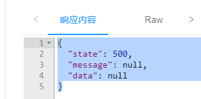

# Sentinel


Sentinel英文翻译"哨兵\门卫,是Spring Cloud Alibaba的组件,以流量为切入点，从**流量控制、熔断降级、系统负载保护等**多个维度保护服务的稳定性,随着微服务的流行,服务和服务之间的稳定性变得越来越重要,为了保证服务器运行的稳定性,在请求数到达设计最高值时,将过剩的请求限流,保证在设计的请求数内的请求能够稳定完成处理

> - 丰富的应用场景 **:** 双11,秒杀,12306抢火车票
>
> - 完备的实时状态监控 **:** 支持显示当前项目各个服务的运行和压力状态,分析出每台服务器处理的秒级别的数据
>
> - 广泛的开源生态 **:** 很多技术可以和Sentinel进行整合,SpringCloud,Dubbo,而且依赖少配置简单
>
> - 完善的SPI扩展 **:** Sentinel支持程序设置各种自定义的规则

``` ABAP
启动: D:\DevelopmentKit\Sentinel\start-sentinel.bat
默认端口: 8080
控制台地址: http://localhost:8080
默认账号: sentinel
默认密码: sentinel
官网地址: https://sentinelguard.io/zh-cn
下载地址: https://github.com/alibaba/Sentinel/releases
```

### 依赖

```xml
<!--在父项目中定义版本号信息-->
<properties>
    <spring-cloud-alibaba.version>2.2.2.RELEASE</spring-cloud-alibaba.version>
</properties>

<!-- 锁版本 -->
<dependencyManagement>
    <dependencies>
        <!-- Spring Cloud Alibaba -->
            <dependency>
                <groupId>com.alibaba.cloud</groupId>
                <artifactId>spring-cloud-alibaba-dependencies</artifactId>
                <version>${spring-cloud-alibaba.version}</version>
                <type>pom</type>
                <scope>import</scope>
            </dependency>
    </dependencies>
</dependencyManagement>

<!-- sentinel依赖 -->
<dependency>
    <groupId>com.alibaba.cloud</groupId>
    <artifactId>spring-cloud-starter-alibaba-sentinel</artifactId>
</dependency>
```

### 配置文件

``` yaml
spring:
  application:
    #  为当前项目起名,这个名字会被Nacos记录并使用
    name: nacos-stock
  cloud:
    sentinel:
      transport:
        dashboard: localhost:8080 # 配置sentinel的位置(运行状态仪表盘)
        # 执行限流的端口号,每个项目都不同(别的项目例如cart模块,要再向设置限流就不能用8721了)
        port: 8721
    nacos:
      discovery:
        # 配置Nacos所在的位置,用于注册时提交信息
        server-addr: localhost:8848
```

### @SentinelResource

``` java
@ApiOperation("减少商品库存数")
// @SentinelResource注解要标记控制层的方法才能生效,会在该方法运行时,被Sentinel管理
// 这个控制器方法第一次运行后,会在Sentinel仪表台中看到限流选项
// "减少商品库存数",会定义仪表台中代表该方法的选项名称
@SentinelResource("减少商品库存数")
public JsonResult reduceCommodityCount(StockReduceCountDTO stockReduceCountDTO){
    // 调用业务逻辑层
    stockService.reduceCommodityCount(stockReduceCountDTO);
    return JsonResult.ok("库存减少已执行");
}
```

**注意: **如果不运行knife4j测试,sentinel的仪表盘不会有任何信息,在第一次运行了减少库存方法之后,sentinel的仪表盘才会出现nacos-stock的信息

### 设置流控规则

我们先设置QPS为1也就是每秒请求数超过1时,进行限流,然后我们可以快速双击knife4j减少库存的方法,触发它的流控效果

这样的流控没有正确的消息提示,我们需要自定义方法进行正确的提示给用户看到

### 自定义降级方法

所谓降级就是正常运行控制器方法的过程中,控制器方法发生了异常,Sentinel支持我们运行别的方法来处理异常,或运行别的业务流程处理,和降级处理有类似的地方,但是Sentinel降级方法优先级高,而且针对单一控制器方法编写,StockController类中@SentinelResource注解中可以定义处理降级情况的方法

``` java
@RestController
@RequestMapping("/base/stock")
@Api(tags = "库存管理")
public class StockController {

    @Autowired
    private IStockService stockService;

    @PostMapping("/reduce/count")
    @ApiOperation("减少商品库存数")
    
    // @SentinelResource注解要标记控制层的方法才能生效,会在该方法运行时,被Sentinel管理
    // 这个控制器方法第一次运行后,会在Sentinel仪表台中看到限流选项
    // "减少商品库存数",会定义仪表台中代表该方法的选项名称
    // blockHandler 能够指定当前方法被限流时运行的方法名称
    // fallback 能够指定当前方法被降级时运行的方法名称
    @SentinelResource(value = "减少商品库存数",blockHandler = "blockError",fallback = "fallbackError")
    public JsonResult reduceCommodityCount(StockReduceCountDTO stockReduceCountDTO){

        //@Test:自定义随机异常
        if (Math.random() <0.5) {
            //如果发送异常会发送服务降级的方法
            throw new CoolSharkServiceException(ResponseCode.BAD_REQUEST, "随机异常");
        }

        // 调用业务逻辑层
        stockService.reduceCommodityCount(stockReduceCountDTO);
        return JsonResult.ok("库存减少已执行");
    }

    //Sentinel自定义限流方法规则如下
    //1.访问修饰符必须是public
    //2.返回值类型必须和控制器方法一致
    //3.方法名必须和对应的限流控制器方法的blockHandler属性一致
    //4.方法参数列表必须和控制器一致,而且还要额外添加BlockException类型的参数
    public JsonResult blockError(StockReduceCountDTO stockReduceCountDTO, BlockException e) {
        //运行在这个方法会被限流,直接返回被限流的提示即可
        return JsonResult.failed(ResponseCode.INTERNAL_SERVER_ERROR,"流量过大服务器忙请稍后再试!");
    }

    //降级方法:上面@SentinelResource中fallbackError指定的降级方法
    //声明格式:和限流方法基本相同,方法参数不需要添加异常类型
    //当控制器方法发生异常时,Sentinel会自动调用这个方法
    //在实际业务中国],可以是运行新的版本代码过程中发送异常后,转而运行老版本代码的机制
    public JsonResult fallbackError(StockReduceCountDTO stockReduceCountDTO,Throwable throwable) {
        throwable.printStackTrace();
        //因为没有老版本代码,所以这里仅仅是输出降级提示
        return JsonResult.failed(ResponseCode.INTERNAL_SERVER_ERROR, "运行发生异常,服务降级");
    }

}

```

### QPS与并发线程数

* > QPS:是每秒请求数 **: **单纯的限制在一秒内有多少个请求访问控制器方法

* > 并发线程数 **: **是当前正在使用服务器资源请求线程的数量,限制的是使用当前服务器的线程数

------

## 

