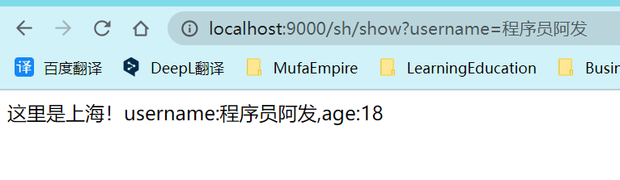

# SpringGateway


**网**:指网络,"关"指关口或关卡,**网关**:就是指网络中的关口\关卡,**"网关"就是当前微服务项目的"统一入口"**,程序中的网关就是当前微服务项目对外界开放的统一入口,所有外界的请求都需要先经过网关才能访问到我们的程序,提供了统一入口之后,方便对所有请求进行统一的检查和管理

> 网关的主要功能有
>
> - 将所有请求统一经过网关
> - 网关可以对这些请求进行检查
> - 网关方便记录所有请求的日志
> - 网关可以统一将所有请求路由到正确的模块\服务上

```ABAP
启动: D:\Spring\SpringCloud\sentinel\start-sentinel.bat
默认端口: 8080
控制台网址: http://localhost:8080
默认账号: sentinel
默认密码: sentinel
官网: https://docs.spring.io/spring-cloud-gateway/docs/current/reference/html/
git项目: https://gitee.com/jtzhanghl/gateway-demo.git
```

### 依赖

SpringGateway网关是一个依赖,不是一个软件,所以我们要使用它的话,必须先创建一个SpringBoot项目,这个项目也要注册到Nacos注册中心,因为网关项目也是微服务项目的一个组成部分,beijing和shanghai是编写好的两个项目,gateway项目就是网关项目,需要添加相关配置

```xml
<!-- 网关项目 -->

<!-- 在父项目中定义版本号信息 -->
<properties>
    <spring-cloud.version>2020.0.3</spring-cloud.version>
    <spring-cloud-alibaba.version>2.2.2.RELEASE</spring-cloud-alibaba.version>
</properties>

<!-- 锁版本 -->
<dependencyManagement>
    <dependencies>
            <!-- Spring Cloud家族 -->
            <dependency>
                <groupId>org.springframework.cloud</groupId>
                <artifactId>spring-cloud-dependencies</artifactId>
                <version>${spring-cloud.version}</version>
                <type>pom</type>
                <scope>import</scope>
            </dependency>
            <!-- Spring Cloud Alibaba -->
            <dependency>
                <groupId>com.alibaba.cloud</groupId>
                <artifactId>spring-cloud-alibaba-dependencies</artifactId>
                <version>${spring-cloud-alibaba.version}</version>
                <type>pom</type>
                <scope>import</scope>
            </dependency>
    </dependencies>
</dependencyManagement>

<!-- Gateway相关依赖 -->
<dependencies>
    <!--   Gateway依赖   -->
    <dependency>
        <groupId>org.springframework.cloud</groupId>
        <artifactId>spring-cloud-starter-gateway</artifactId>
    </dependency>
    <!-- 网关负载均衡依赖 -->
    <dependency>
        <groupId>org.springframework.cloud</groupId>
        <artifactId>spring-cloud-starter-loadbalancer</artifactId>
    </dependency>
    <!--   Nacos依赖   -->
    <dependency>
        <groupId>com.alibaba.cloud</groupId>
        <artifactId>spring-cloud-starter-alibaba-nacos-discovery</artifactId>
    </dependency>
</dependencies>
```

```xml
<!-- 路由项目 -->

<!-- 在父项目中定义版本号信息 -->
<properties>
    <spring-boot.version>2.5.4</spring-boot.version>
    <spring-cloud-alibaba.version>2.2.2.RELEASE</spring-cloud-alibaba.version>
</properties>

<!-- 锁版本 -->
<dependencyManagement>
    <dependencies>
            <!-- Spring Boot Web：WEB应用 -->
            <dependency>
                <groupId>org.springframework.boot</groupId>
                <artifactId>spring-boot-starter-web</artifactId>
                <version>${spring-boot.version}</version>
            </dependency>
            <!-- Spring Cloud Alibaba -->
            <dependency>
                <groupId>com.alibaba.cloud</groupId>
                <artifactId>spring-cloud-alibaba-dependencies</artifactId>
                <version>${spring-cloud-alibaba.version}</version>
                <type>pom</type>
                <scope>import</scope>
            </dependency>
    </dependencies>
</dependencyManagement>

<!-- Gateway相关依赖 -->
<dependencies>
    <dependency>
        <groupId>org.springframework.boot</groupId>
        <artifactId>spring-boot-starter-web</artifactId>
    </dependency>
    <dependency>
        <groupId>com.alibaba.cloud</groupId>
        <artifactId>spring-cloud-starter-alibaba-nacos-discovery</artifactId>
    </dependency>
</dependencies>

```


### 配置文件

```yaml
# 网关项目

server:
  port: 9000
spring:
  application:
    name: GatewayDemo
  cloud:
    nacos:
      discovery:
        # 配置Nacos所在的位置,用于注册时提交信息
        server-addr: localhost:8848
        # ephemeral设置当前项目启动时注册到nacos的类型 true(默认):临时实例 false:永久实例
        ephemeral: true
    gateway:
      # routes就是路由的意思,在此处配置是一个数组类型
      routes:
        # 数组类型中编写 "-"开头,表示是一个数组元素
        # id表示当前路由的名称,没有和其他任何出现过的名字关联,和之后的内容也没有关联
        - id: gateway-beijing
          # 当前路由配置的路由目标配置,也就是路由路径
          # lb是LoadBalance的缩写,beijingGatewayDemo是路由目标服务器的名称和目标服务器注册在nacos上的名称
          # beijingGatewayDemo不能有其他符号"_"/"-"/"."等,例如beijing-Gateway_Demo,
          # 这种符号虽然nacos是允许的但SpringGateway会报java.lang.IllegalStateException: Invalid host: lb://异常
          uri: lb://beijingGatewayDemo
          # 下面编写路由条件\规则,也就是满足什么样的路径会访问beijing服务器
          # 我们要配置内置断言来配置路径路径   predicates(断言)
          predicates:
            # 断言其实就是满足某个条件时做什么操作的设置
            # predicates和routes类似,也是一个数组类型
            # ↓  P大写!!!!!  表示以/bj/开头的请求都会路由到beijing服务器
            - Path=/bj/**
            # spring.cloud.gateway.routes[0].uri
            # spring.cloud.gateway.routes[0].predicates[0]
        - id: gateway-shanghai
          uri: lb://shanghaiGatewayDemo
          predicates:
            - Path=/sh/**
```

``` yaml
# 路由项目

server:
  port: 9001
spring:
  application:
    name: beijingGatewayDemo # 定义当前服务名称
  cloud:
    nacos:
      discovery:
        server-addr: localhost:8848 # 指定正在运行的Nacos服务器的位置
        # ephemeral设置当前项目启动时注册到nacos的类型 true(默认):临时实例 false:永久实例
        ephemeral: true
```

### 动态路由

网关项目随着微服务数量的增多,**gateway项目的yml文件**配置会越来越多,维护的工作量也会越来越大,所以我们希望gateway能够设计一套默认情况下自动路由到每个模块的路由规则,这样的话不管当前项目有多少个路由目标,都不需要维护yml文件了,这就是SpringGateway的动态路由功能,只需在配置文件中开启即可

```yaml
# 网关项目

server:
  port: 9000
spring:
  application:
    name: gateway
  cloud:
    nacos:
      discovery:
        # 网关也是微服务项目的一部分,所以也要注册到Nacos
        server-addr: localhost:8848
    gateway:
      discovery:
        locator:
          # 这就是开启动态路由的配置,动态路由配置默认是关闭的,需要手动开启才能生效
          # 动态路由生成规则为:在网关端口号后先写要路由到的目标服务器在nacos注册的名称
          # 再编写具体路径
          # 例如 localhost:9001/bj/show   ->  localhost:9000/beijingGatewayDemo/bj/show
          enabled: true

         # 开启 enabled: true 动态路由后不需要编写如下路由数组也可以
         # 通过 localhost:9000/beijingGatewayDemo/sh/show 访问到 beijingGatewayDemo 服务器
#        - id: gateway-beijing
#          uri: lb://beijingGatewayDemo
#          predicates:
#            - Path=/bj/**
```

### 内置断言

我们上次课在网关配置中使用了predicates(断言)的配置,断言的意思就是判断某个条件是否满足,我们之前使用了Path断言,判断请求的路径是不是满足条件,例如是不是 /bj/** ,如果路径满足这个条件,就路由到指定的服务器,但是Path实际上只是SpringGateway提供的多种内置断言中的一种,还有很多其它断言,同样也是在yml配置中添加相关配置即可实现

> - after
> - before
> - between
> - cookie
> - header
> - host
> - method
> - path
> - query
> - remoteaddr

#### 时间相关

after,before,between,判断当前时间在指定时间 之前,之后 或 之间 的操作,如果条件满足可以执行路由操作,否则拒绝访问,表示时间的格式比较特殊,先使用下面代码获得时间

```java
ZonedDateTime.now()
    // 运行程序输出,可获得当前时间,这个时间的格式可能是
    // 2022-09-27T10:19:46.898+08:00[Asia/Shanghai]
```

使用**After**设置必须在指定时间之后访问,否则发生404错误拒绝访问,必须通过9000端口(即路由项目)访问才能有效果

```yaml
# 网关项目

routes:
  - id: gateway-shanghai
    uri: lb://shanghaiGatewayDemo
    predicates:
      - Path=/sh/**
      # 当前断言是两个条件,第一是   "路径必须用/sh/开头"  即 动态路由不起效果
      # 第二是访问的时间   "必须在下面指定的时间之后"    , 而且两个条件必须同时满足,才能路由
      - After=2022-09-27T10:19:46.898+08:00[Asia/Shanghai]
```

使用**Before**设置必须在指定时间之前访问

```yaml
# 网关项目

routes:
  - id: gateway-shanghai
    uri: lb://shanghaiGatewayDemo
    predicates:
      - Path=/sh/**
      # 当前断言是两个条件,第一是路径必须用/sh/开头
      # 第二是访问的时间必须在下面指定的时间之后, 而且两个条件必须同时满足,才能路由
      - Before=2022-09-27T10:19:46.898+08:00[Asia/Shanghai]
```

使用**Between**设置必须在指定时间之间访问

```yaml
# 网关项目

routes:
  - id: gateway-shanghai
    uri: lb://shanghaiGatewayDemo
    predicates:
      - Path=/sh/**
      # 当前断言是两个条件,第一是路径必须用/sh/开头
      # 第二是访问的时间必须在下面指定的时间之后, 而且两个条件必须同时满足,才能路由
      - Between=2022-09-27T10:33:20.898+08:00[Asia/Shanghai],2022-09-27T10:33:40.898+08:00[Asia/Shanghai]
```

#### 指定参数请求

**Query断言**,判断是否包含指定的参数名称,包含参数名称才能通过路由(即 http://localhost:9000/sh/show?username=tom)

```yaml
# 网关项目

routes:
  - id: gateway-shanghai
    uri: lb://shanghaiGatewayDemo
    predicates:
      - Path=/sh/**
      # 判断是否包含指定参数名称(username)的断言,不包含就不能正常路由
      # 当前断言是两个条件,第一是路径必须用/sh/开头
      # 第二是访问的时间必须在下面指定的时间之后, 而且两个条件必须同时满足,才能路由
      - Query=username
```

### 内置过滤器

Gateway还提供的内置过滤器,**不要和filter混淆**,Gateway内置过滤器允许在路由请求到目标资源的同时,对这个请求进行一些加工或处理,常见过滤器也有一些,如下AddRequestParameter过滤器,它的作用是在请求中添加参数和它对应的值

#### 配置文件

```yaml
# 网关项目

routes:
  - id: gateway-shanghai
    uri: lb://shanghaiGatewayDemo
    filters:
      # 内置过滤器功能,AddRequestParameter在路由到指定控制器方法之前
      # 在请求中添加参数age=18,控制器方法运行时可以通过age获取该值
      - AddRequestParameter=age,18
    predicates:
      - Path=/sh/**
      # 判断是否包含指定参数名称(username)的断言,不包含就不能正常路由
      - Query=username
```

#### Java实现

在shanghaiGatewayDemo服务武器项目的控制器方法中添加代码接收name,age的值

```java
// 路由项目

@RestController
@RequestMapping("/sh")
public class ShanghaiController {

    @GetMapping("/show")
    public String show(String username,Integer age){
        System.out.println(ZonedDateTime.now());
        return "这里是上海！username:"+username+",age:"+age;
    }
    
}
```



